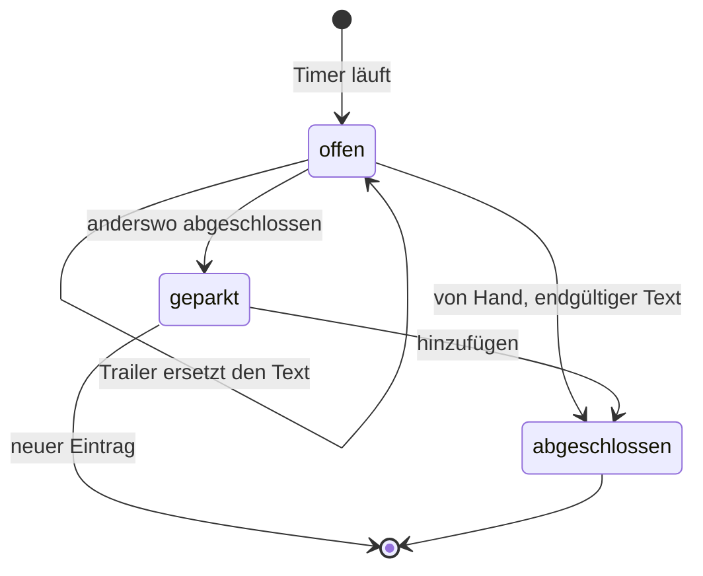
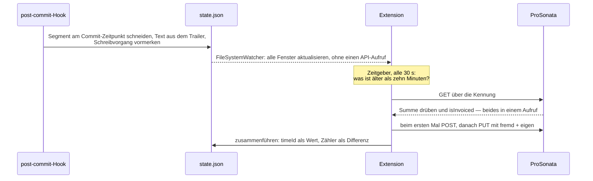
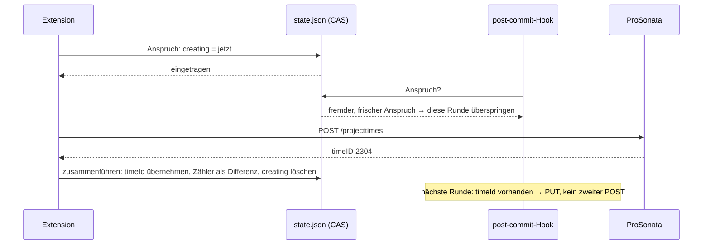

# ProSonata Zeiterfassung – Konzept

Werkzeug zur Zeiterfassung für Code-Arbeit, angebunden an ProSonata (SaaS, REST API).
Bedienung über eine VS-Code-Extension, Beschreibung der Arbeit über Git-Commits.

Dieses Dokument ist die Entscheidungsgrundlage, nicht die Zustandsbeschreibung: Es beschreibt,
wie das Werkzeug gedacht ist, auch wo das noch nicht gebaut ist. Was fehlt, steht gesammelt in
Abschnitt 13 und ist an Ort und Stelle als *noch nicht gebaut* gekennzeichnet. Abschnitt 11
listet bewusst verworfene Alternativen – diese nicht erneut vorschlagen.

---

## 1. Problem und Grundidee

**Das Problem sind die vergessenen Timer.** Bei der Arbeit in VS Code geht regelmässig
unter, in ProSonata einen Timer zu starten oder zu beenden. Ein vergessener Start ist
verlorene Zeit, ein vergessenes Ende ist eine falsche Zeit – beides endet in geschätzten
Nachträgen.

**Der zweite Hebel ist der Text.** Was gearbeitet wurde, lässt sich am besten dort
beschreiben, wo die Arbeit stattfindet: im Editor, beim Commit. Nicht Tage später in einer
fremden Oberfläche.

**Deshalb koppelt dieses Werkzeug die Zeiterfassung an Commits und Branches** und macht
Arbeit am Code semi-automatisch zu Zeiteinträgen. „Semi-automatisch" heisst: Start und Pause
bleiben Handarbeit, alles danach geschieht von selbst.

Daraus folgen die tragenden Entscheidungen:

**Der Timer läuft lokal, ProSonata bekommt nur Zeiteinträge.**
Eine Timer-API ist **nicht vorgesehen**, vom Hersteller bestätigt: Timer liegen dort historisch
bedingt serialisiert in einem Feld beim Benutzer, nicht in einer eigenen Tabelle, und wären über
eine Schnittstelle nur schwer abzubilden. Die lokale Emulation ist damit keine Übergangslösung,
sondern der Dauerzustand – semantisch identisch, und ohne fremde Abhängigkeit.

**Zeit und Text sind entkoppelt.**
Der Timer misst. Der Commit beschreibt.

**Start und Pause geschehen immer von Hand.**
Keine Automatik aus Editor-Aktivität, Branch-Wechseln oder Dateiänderungen. Das Werkzeug
**warnt** bei erkennbarer Fehlbedienung (Abschnitt 3), aber es bucht nie von selbst.

**Die Linie liegt zwischen Fragen und Tun, nicht zwischen Erkennen und Nichterkennen.** Das
Werkzeug darf einen Zeitpunkt bemerken und ihn zur Sprache bringen; was daraus folgt, entscheidet
ein Mensch. Ein Dialog mit zwei Knöpfen ist deshalb kein Verstoss gegen diesen Grundsatz, sondern
seine Anwendung – ein Timer, der ohne Antwort zu laufen beginnt, wäre einer.

**Der Code wird geschrieben, als würde er veröffentlicht.**
Das Repo ist öffentlich. Eine Marketplace-Extension ist **nicht** beschlossen, aber möglich –
und die Anforderungen aus Abschnitt 10 kosten während der Entwicklung fast nichts, während
sie nachträglich einzubauen ein Umbau wäre.

---

## 2. Zwei Ebenen: Segment und Zeiteintrag

Die wichtigste Unterscheidung des Konzepts, und die Quelle der meisten Missverständnisse,
wenn sie fehlt:

- **Segment** – eine gemessene Arbeitsstrecke. Entsteht beim Start, endet bei Pause oder
  Commit. Bleibt **lokal** und erreicht ProSonata nie einzeln.
- **Zeiteintrag** – ein `projecttimes`-Datensatz in ProSonata. Trägt Zeit, Projekt, Kategorie
  und den Text, den der Kunde auf der Rechnung liest.

**Segmente sind die Messung, Zeiteinträge sind die Abrechnung.** Viele Segmente ergeben einen
Zeiteintrag. Wie viele, entscheidet Abschnitt 3.

---

## 3. Fachliche Semantik

Der Abschnitt folgt dem Lebenslauf eines Zeiteintrags: **woraus er entsteht** (Modi und
Umschalter), **die Messung** darunter (Segmentprotokoll, Mitternacht), **was er trägt** (Zeit,
Datum, Raster, Text, Marker), **was mit ihm geschieht** (Commit, Abschluss, Rechnung, Rückroll,
zweiter Rechner) und zuletzt, **wo ein Mensch eingreift** (Warnungen, Korrektur, Zuschlagen,
Durchsehen).

### Woraus ein Zeiteintrag entsteht

| Ort der Arbeit | Zeiteintrag |
|---|---|
| **Branch** (nicht der Hauptbranch) | **Ein Zeiteintrag pro Branch**, wächst über dessen ganze Lebensdauer |
| **Hauptbranch** | **Ein Zeiteintrag pro Commit** |
| *umschaltbar* | **Ein Zeiteintrag pro Branch und Tag** – die Klammer bleibt der Branch, geschnitten wird an Mitternacht |

**Die beiden Modi bedienen zwei Abrechnungsarten.** Das ist die Unterscheidung, aus der alles
Weitere folgt:

| Modus | gedacht für | Was die Rechnungszeile benennt |
|---|---|---|
| **pro Commit** | Abrechnung nach **Zeit** | einen Zeitraum, in dem gearbeitet wurde |
| **pro Branch** | Abrechnung nach **Leistung** | ein Stück Arbeit, das geliefert wurde |

Wer nach Zeit abrechnet, dem schuldet die Rechnung den Nachweis: wann, wie lange, woran. Viele
kleine Zeilen sind dort kein Makel, sondern der Beleg. Wer nach Leistung abrechnet, dem schuldet
sie das Gegenteil: **eine** Zeile mit einem Namen, den der Kunde wiedererkennt.
„Buchungsmodul: 12,5 h" – nicht fünfzehn Commit-Subjects.

Der Branch ist die natürliche Klammer für den zweiten Fall, weil er ohnehin um ein Stück Arbeit
gezogen wird und sein Ende von Git erzwungen wird, nicht von der Disziplin. Auf dem Hauptbranch
wird dagegen typischerweise Wartung erledigt, wo jeder Commit für sich eine abgeschlossene
Kleinigkeit ist – und wo die Rechnung ohnehin nach Zeit gestellt wird.

**Daran hängen die Einzelheiten, und dort erklärt sich, was sonst wie ein Mangel aussieht:**

- **Die Tagesspanne** (`workingTimeStart`/`-End`) fällt bei einem mehrtägigen Eintrag weg, weil
  sie über Tagesgrenzen nichts Wahres sagen könnte (unten, *Zeitwert und Datum*). Beim Abrechnen
  nach Zeit wäre das ein Verlust – dort ist sie der Nachweis. Beim Abrechnen nach Leistung fehlt
  sie niemandem: Bezahlt wird das Ergebnis, nicht die Anwesenheit.
- **Das Datum** benennt beim Commit-Eintrag den Arbeitstag, beim Branch-Eintrag nur den Tag der
  Fertigstellung. Auch das ist im ersten Fall wesentlich und im zweiten nebensächlich.
- **Gerundet wird je Eintrag**, also je abgerechneter Einheit. Bei Zeitabrechnung ist die
  Einheit der Arbeitsabschnitt, bei Leistungsabrechnung die Leistung.

Wer nach Zeit abrechnet, aber auf Branches arbeitet, hat deshalb ein Problem, das der Modus
`pro Branch` nicht löst – dafür ist der dritte Modus da, *pro Branch und Tag* (unten).

Der Hauptbranch ist **konfigurierbar**. Default ist der Branch, auf den
`refs/remotes/origin/HEAD` zeigt, ersatzweise `main`.

Kurzform im weiteren Text: **Branch-Eintrag** für den einen Zeiteintrag eines Branches.

### Umschalter pro Branch

Die Tabelle oben ist die **Voreinstellung**, nicht das Gesetz. Für jeden Branch lässt sich der
Modus umschalten – `pro Branch`, `pro Branch und Tag` oder `pro Commit`; in der CLI heisst der
mittlere `tag`. Auf dem Hauptbranch steht er fest auf `pro Commit` und ist deaktiviert: dort gibt
es keine Klammer, die einen wachsenden Eintrag rechtfertigen würde.

Gebraucht wird das, wenn ein Branch ausnahmsweise nicht als eine Rechnungszeile taugt – etwa
weil auf ihm mehrere unabhängige Kleinigkeiten liegen, die der Kunde einzeln sehen soll.

- Ablage in `git config --local` unter der **Kennung** des Branches (Abschnitt 3), nicht unter
  seinem Namen: `prosonata.mode.a3f9c1 = commit`. Branchnamen enthalten Schrägstriche und
  Punkte und wären als Config-Schlüssel unhandlich.
- **Ein Umschalten wirkt ab dem nächsten Commit.** Bereits abgeschlossene Zeiteinträge bleiben,
  wie sie sind.
- Wird von `pro Branch` auf `pro Commit` umgeschaltet, während ein Branch-Eintrag offen ist,
  wird dieser **abgeschlossen** – mit Rückfrage nach dem endgültigen Text, wie bei jedem
  Abschluss. Umgekehrt beginnt der nächste Commit einen neuen Branch-Eintrag.
- Der Umschalter steht im Panel (Abschnitt 8), wo auch der aktuelle Branch sichtbar ist.

### Ein Eintrag pro Branch und Tag

Der dritte Modus schneidet einen Branch-Eintrag, der über mehrere Tage wächst, an **jeder
Mitternacht**. Er beantwortet, was `date` sonst falsch beantwortet: Ein dreiwöchiger Eintrag
trägt seine ganzen Stunden auf dem Tag des letzten Schreibvorgangs.

- **Die Grenze liegt auf Mitternacht, nicht auf einem wählbaren Tagesbeginn.** Sobald ein
  Eintrag ein Datum **und** Uhrzeiten trägt, müssen beide zusammenpassen; `22:00–02:00` auf dem
  17. wäre unlesbar. Der Tag ist **halboffen**: Was um Mitternacht endet, gehört zum alten Tag,
  was dort beginnt, zum neuen. Ein Eintrag von 0:00 bis 0:00 kann so nicht entstehen.
- **Der Eintrag trägt seinen Tag** (`day`), und der Versand schreibt ihn als `date`. Nur
  Einträge dieses Modus tragen das Feld – es ist zugleich die Markierung, an der der Wechsel
  hängt. Deshalb braucht der Versand den Modus nicht zu kennen, was ihm einen `git`-Aufruf je
  laufendem Timer erspart.
- **Der Nachfolger erbt den Text.** Es ist dieselbe Arbeit, nur ein neuer Tag – anders als nach
  einem Commit auf dem Hauptbranch, wo der nächste Commit seinen eigenen Text mitbringt.
- **Die Tagesspanne wird dadurch wieder brauchbar.** Heute verliert sie jeder Eintrag, der über
  Mitternacht wächst; am eigenen Konto sind das 327 von 559. Wurde ein Tag durchgearbeitet,
  endet sein letztes Segment auf `00:00:00` – geschrieben wird dann `23:59`, weil das Feld
  nichts Späteres kann. Verkürzt ist damit die **Anzeige**, nicht die Dauer.

  Daraus folgt ein Fall, den es vorher nicht gab: **Die Spanne kann kürzer aussehen als die
  Dauer.** Wer von 23:30 bis 00:30 arbeitet, bekommt für den ersten Tag `23:30–23:59` bei
  0,50 h. Bisher war eine Spanne stets länger als die Dauer, weil Pausen darin liegen.
  Gerechnet wird daraus nichts.
- **Ausgelöst wird der Wechsel von der ersten Buchung, deren Tag nicht der Tag des Eintrags
  ist** – kein Zeitgeber, kein Hintergrundprozess. Ein Rechner, der über Nacht steht, holt den
  Wechsel beim nächsten Start nach.

**Bekannte Grenze:** Wechseln zwei Rechner derselben Person den Tag, bevor sie den Eintrag des
anderen gesehen haben, entstehen zwei Einträge für denselben Branch-Tag. Dieselbe Klasse wie
Abschnitt 12, Punkt 4, und mit derselben Voraussetzung: Es misst immer nur einer.

Zwei Dinge sind entworfen und **nicht gebaut**:

- **Eine Repo-Vorgabe `prosonata.mode`**, damit ein ganzes Projekt einmal eingestellt wird statt
  Branch für Branch – dieselbe Kette wie beim Raster, `readRepoConfig(root).mode ?? config.mode`.
  Heute fällt `modeFor` ohne Eintrag auf `branch` zurück.
- **Den endgültigen Text beim Abschluss über die zurückliegenden Tage nachziehen.** Gefunden
  würden sie über `kennung]` in einem gefilterten GET, der `detail` und `isInvoiced` mitliefert.
  Zwei Regeln gehörten dazu: nachgezogen wird **nur, wo der Text noch der ist, den das Werkzeug
  hinterlassen hat** – sonst bräche es das Versprechen, dass ein abgeschlossener Eintrag dem
  Benutzer gehört –, und **fakturierte Tage bleiben unberührt**, weil ihr Text wahrheitsgemäss
  sagt, wie der Stand beim Abrechnen war. Ein Zwanzig-Tage-Branch kostete einen GET und bis zu
  zwanzig PUT; gegen 50 Aufrufe je Viertelstunde machbar, aber ein Stoss, der im Fehlerfall
  fortsetzbar sein muss. Dass die zurückliegenden Tage bis dahin einen vorläufigen Text tragen,
  ist kein Mangel: Er sagt, woran an jenem Tag gearbeitet wurde.

**Offen ist die Anzeige nach Mitternacht.** Die Zeile *Läuft* im Panel zeigt Strecke und die
Sekunden des **Eintrags**; im Tagesmodus fällt die zweite Zahl um Mitternacht auf null zurück.
Inhaltlich richtig – es ist, was heute auf die Rechnung geht –, aber unerklärt. Vorschlag, noch
nicht entschieden: *Läuft* zeigt die Branch-Summe über alle Tage, die Zeile *Offener Eintrag*
den heutigen.

### Das Segmentprotokoll

`segments.jsonl` hält **jedes gemessene Segment** fest: Beginn, Ende, Dauer, Repository,
Branch, Projekt und was das Segment beendet hat – Pause, Commit, eine Kürzung von Hand oder,
ohne laufenden Timer, eine reine Korrektur.
Anders als `log.jsonl`, das ein Puffer ist und gekürzt wird, ist es ein **Archiv**.

Es beantwortet zwei Fragen, die sonst niemand beantworten kann:

- **Wie viel wurde an welchem Tag gearbeitet?** Ein Zeiteintrag trägt eine Summe und ein
  Datum – das seines letzten Schreibvorgangs. Ein Branch über drei Wochen sagt über den
  Dienstag in der Mitte nichts.
- **Was war auf einem Branch, den es nicht mehr gibt?** Die Branch-Liste der Ansicht stammt
  aus dem Protokoll, nicht aus Git. Gelöschte Branches behalten damit ihre Stunden.

Wird ein Zeiteintrag **abgeschlossen**, bekommt er eine eigene Zeile: ohne Zeiten, mit der
Summe, mit der er geschlossen wurde, und dem Vermerk *Zeiteintrag*. Sie trennt im Protokoll eine
Rechnungsposition von der nächsten – alles darüber gehört zu ihr. Der Text des Eintrags steht
dabei bewusst **nicht** in jeder Segmentzeile: Das wäre auf jeder Zeile dieselbe Wiederholung,
während eine Abschlusszeile es einmal sagt. Ihre `seconds` sind null, denn die Zeit steht bereits
in den Segmenten darüber; zählte sie mit, verdoppelte sich jeder Tag, an dem etwas abgeschlossen
wird.

Besonders festgehalten wird die **Kürzung**: mit der behaltenen Spanne *und* der tatsächlich
gelaufenen Dauer. Es ist die einzige Stelle, an der gemessene Zeit absichtlich verschwindet –
sie darf nicht zusätzlich unbemerkt verschwinden.

Gezeigt wird das Protokoll als **gesetzte Markdown-Vorschau** von VS Code, mit einer QuickPick
für den Branch davor; im Terminal gibt `prosonata log` dasselbe aus. Kein eigenes Webview
(Abschnitt 8): Der Text kommt aus einem `TextDocumentContentProvider` unter dem Schema
`prosonata:`, VS Code setzt ihn. Damit ist er nicht bearbeitbar, ohne dass es jemand verbieten
müsste – ein unbenanntes Dokument liesse sich beschreiben und fragte beim Schliessen nach dem
Speichern einer Datei, die es nie gab. Die Darstellung selbst liegt in `core`, damit beide
Frontends dieselben Summen und dieselben Worte zeigen.

Was es nicht weiss: den anderen Rechner. Segmente werden dort aufgezeichnet, wo sie anfallen –
ProSonata hält die Summe beider, dieses Protokoll die Einzelheiten eines einzigen.

**Warum es nicht bearbeitbar ist.** Die Frage kommt naheliegenderweise auf: Da steht eine Liste,
und in ihr steht eine falsche Zeile. Bearbeiten wäre trotzdem falsch:

- Das Protokoll ist **keine Autorität**. Abgerechnet wird die Summe des Zeiteintrags – eigene
  plus fremde Sekunden – und, sobald gesendet, der Eintrag in ProSonata; die Segmente fliessen nie dorthin zurück. Eine geänderte Zeile
  änderte den Bericht, nicht die Rechnung – danach widersprächen sich beide, und das Protokoll
  wäre das Dokument, das lügt.
- Es wird **nur angehängt**. Das macht es unempfindlich gegen Abstürze: Eine abgerissene Zeile
  kostet diese Zeile, nicht die Datei. Bearbeiten hiesse, die Datei neu zu schreiben.
- Das Ändern einer Summe **gibt es bereits**, in der Form, die zum Archiv passt: als
  Korrekturzeile. Sie hängt an, statt zu überschreiben, und hält damit fest, *dass* korrigiert
  wurde – ein Bearbeiten löschte genau diese Spur.
- Der auf einem anderen Rechner gemessene Anteil liegt gar nicht hier und wäre von hier aus
  ohnehin nicht zu berichtigen.

Was hier korrigiert werden kann, ist das laufende Segment – über die Zeitkorrektur (unten, *Zeit
vor- und zurückdrehen*). Ein bereits **gesendeter** Eintrag wird nicht über das Protokoll
berichtigt, sondern als das, was er ist: ein Datensatz in ProSonata (unten, *Zeiteinträge
durchsehen und berichtigen*).

### Ein Segment über Mitternacht

Wird an jeder Grenze zerlegt, und zwar **in allen drei Modi**. Der Grund liegt im
Segmentprotokoll: Es gruppiert nach dem **Ende** eines Segments, also landete eine ungeteilte
Nacht von 22:00 bis 02:00 vollständig auf dem zweiten Tag, und der erste verlor seine zwei
Stunden – das Protokoll beantwortete die eine Frage falsch, für die es angelegt ist.

Geteilt wird die **Aufzeichnung** immer, die **Buchung** auf verschiedene Einträge nur im
Tagesmodus; sonst tragen beide Hälften dieselbe Eintrags-Kennung.

### Zeitwert und Datum

- `workingTime` ist die **absolute Summe in Dezimalstunden**, nicht die Differenz.
  Damit ist jeder Schreibzugriff idempotent: ein Wiederholungsversuch verdoppelt nichts, und
  es braucht kein Read-Modify-Write.
- Das **Zeitraster** ist pro Repo einstellbar; Default ist exakt mit zwei Nachkommastellen
  (0,01 h = 36 s). Gerundet wird beim Schreiben, damit der angezeigte Wert der abgerechnete
  ist.
- `date` wird bei **jedem** Schreibzugriff auf **heute** gesetzt. Das Datum benennt damit die
  **Fertigstellung**, nicht den Beginn. Ein Zeiteintrag darf sich über mehrere Tage erstrecken;
  kein Sonderfall um Mitternacht, kein automatisches Schliessen bei Tageswechsel. Die eine
  Ausnahme ist der Modus *pro Branch und Tag*: Dort trägt der Eintrag seinen Tag (`day`), der
  Versand schreibt ihn als `date`, und Mitternacht ist die Grenze zum nächsten Eintrag.
- **„Heute" ist die lokale Zeit des schreibenden Rechners**, nicht UTC. Der Arbeitstag ist
  durch die eigene Uhr definiert, nicht durch einen Meridian. Eine Umrechnung findet ohnehin
  nicht statt: `date` ist in der API ein reines Datum ohne Zeitanteil. Die einzige Frage ist,
  welchen Tag der Client für heute hält – und das ist der, an dem der Benutzer sitzt.
  Der Randfall bleibt bewusst: Wer über Mitternacht hinaus arbeitet und danach schreibt,
  bekommt den neuen Tag. Das passt zur Datumssemantik.
- `workingTimeStart` und `workingTimeEnd` tragen die **Spanne des Arbeitstages**: den Beginn
  des ersten und das Ende des jüngsten Segments dieses Eintrags, aus dem Segmentprotokoll.
  ProSonata zeigt beide nur an und rechnet nichts daraus; für die Rechnung zählt die Dauer.
  **Beide Enden müssen auf denselben Tag fallen** – sonst wird `null` geschrieben, was die
  Felder löscht. Eine Spanne sagt nur etwas über einen Tag; `08:12–17:40` auf einem Eintrag,
  der über drei Wochen gewachsen ist, behauptete eine Anwesenheit, die es nie gab. Wächst ein
  Eintrag über Mitternacht, verliert er seine Spanne also wieder. Mit dem Modus hat das nichts
  zu tun: Auch ein Commit-Eintrag kann über Mitternacht gehen.
- **Der laufende Timer steht nicht in diesen Feldern, sondern in der Marke** (unten, *Offene
  Zeiteinträge*).
  Früher trug `workingTimeStart` diesen Zustand – die blosse Anwesenheit hiess „hier läuft ein
  Timer". Das kostete zweierlei: das Feld selbst, und die Auskunft, *wann*. Eine Uhrzeit ohne
  Tag lässt einen auf einem schlafenden Rechner vergessenen Timer eine Woche später aussehen
  wie einen von heute früh. Ein zweiter Rechner **warnt** daran weiterhin – anhalten kann er
  nichts, ein schlafender Rechner liest nichts, und was diese Stunden waren, weiss nur, wer
  dabei war.
- Der Vermerk reist mit einem **ohnehin fälligen** Schreibvorgang, nie mit einem eigenen
  Aufruf. Er ist damit bis zu zehn Minuten alt; für eine Warnung genügt das. Das Pausieren
  merkt dafür einen Schreibvorgang vor, damit der Vermerk auch wieder verschwindet – beim
  Schliessen von VS Code sofort, weil dort ohnehin gesendet wird.
- **Am Konto gemessen:** Die Kurzform `09:12` wird angenommen und als `09:12:00` gespeichert,
  `null` löscht wirklich – ein leerer String dagegen schreibt `01:00:00` hinein.

### Das Zeitraster

Gerundet wird **einmal**: beim Schreiben, auf die Gesamtsumme des Zeiteintrags. Segmente bleiben
sekundengenau – rundete jedes für sich, summierten sich die Fehler. Gerundet wird **aufwärts**
(`Math.ceil`): Bei einem Raster von 15 Minuten werden aus 2:05 h gebuchte 2.25 h – angezeigt
wird dieser Wert aber als `2:15 h`. Dezimalstunden sind das Format der API, nicht das des Lesers;
`billedTime()` in [report.ts](src/core/report.ts) ist die einzige Stelle, die umrechnet.

Weil je Eintrag gerundet wird, **wächst die Rundung mit der Zahl der Einträge**: Drei Commits mit
je zwanzig Minuten werden zu dreimal einer halben Stunde, also 1:30 h statt einer Stunde. Im
Modus *pro Branch* dagegen wird dieselbe Arbeit einmal gerundet. Der Bericht muss das nachbilden
(`billedSeconds()` gruppiert nach `entryId`) – rechnete er aus der Gesamtsumme, zeigte er
weniger an, als in Rechnung gestellt wird. Gezeigt wird die Zahl nur, wenn das Raster sie
tatsächlich verändert; sonst stünde dieselbe Zahl zweimal.

Das Raster gehört zum **Repository**, denn die Abmachung, wie gerundet wird, gehört zum Kunden.
Hat ein Repository keines, gilt die Vorgabe aus `config.json`; die ist nur dort zu ändern und
steht auf `exakt`. Beides zusammen ist eine Kette – `readRepoConfig(root).grid ?? config.grid` –,
und sie muss überall dieselbe sein: Panel, Log **und** Versand. Genau daran fehlte es lange: Der
Versand kannte nur die Vorgabe, sodass ein Repository eine Rundung anzeigen konnte, die nie
stattfand.

Gefragt wird im Augenblick des Schreibens, nicht beim Anlegen des Eintrags. Damit erreicht ein
geändertes Raster jeden noch offenen Eintrag – dieselbe Linie wie bei Projekt und Kategorie, wo
eine Korrektur ebenfalls alles Unfertige mitzieht.

### Der Text

Der Text geht auf die **Kundenrechnung**. Woher er im Einzelnen stammt, steht in *Marker im
Commit* und in *Wirkung eines Commits*. Zwei Eigenschaften gelten übergreifend:

- **Beim ersten Commit auf einem neuen Branch** fragt das Werkzeug einmal nach einer
  Bezeichnung. *(Die Rückfrage ist verworfen: Ein Rechnungstext, der beim Start entsteht, ist
  geraten – formulieren lässt er sich erst, wenn der Commit bereitliegt. An ihre Stelle tritt
  der Platzhalter aus Abschnitt 4.)* Damit auf einem Branch niemand vergisst, ihn zu ersetzen,
  zeigt das Panel dort die Zeile **Ohne Text**, die zum Textfeld führt. Auf dem Hauptbranch
  erscheint sie nicht: Dort bringt der nächste Commit den Text ohnehin mit.
- **Änderbar bleibt er jederzeit**, über die Oberfläche oder über einen späteren Commit. Oft
  lässt sich der endgültige Rechnungstext erst bei Fertigstellung sinnvoll schreiben.

### Marker im Commit

Der Beschreibungstext für ProSonata steht in einem **Git-Trailer** als letzter Absatz der
Commit-Message:

```
fix: Rundungsfehler in der zweiten Rabattstufe

Test ergänzt, Grenzwerte geprüft.

Prosonata: Korrektur der Rabattberechnung im Shop
```

- Extraktion per `git interpret-trailers --parse`, kein eigener Parser. Weitere Trailer im
  selben Absatz (etwa `Co-Authored-By:`) stören nicht.
- Das Schlüsselwort ist **`Prosonata`**, konfigurierbar. Es benennt das Zielsystem, ist ein
  Eigenname und braucht deshalb für die veröffentlichte Extension keine Übersetzung – anders
  als ein deutsches `Zeit`. Und es kollidiert nicht: `Zeit: 3 Stunden` könnte jemand als
  gewöhnlichen Satz in den letzten Absatz schreiben, und Git läse es als Trailer.
  Verglichen wird ohne Rücksicht auf Gross- und Kleinschreibung.
- **Nicht `#` als Markerzeichen** – Git strippt Kommentarzeilen.
- Auf einem **Branch** ersetzt ein Trailer den Text des Branch-Eintrags. Der letzte gewinnt.
- Auf dem **Hauptbranch** setzt er den Text des Zeiteintrags, den dieser Commit abschliesst;
  ohne Trailer gilt das Subject.

Der Fallback auf das Subject ist ein Angebot, kein Freibrief: technische Subjects sind vor dem
Fakturieren zu prüfen. Der Text ist in ProSonata jederzeit nachbearbeitbar.

### Offene Zeiteinträge: `[LAUFEND:kennung]`

Ein Branch-Eintrag ist wochenlang offen. Solange steht am Anfang seines Textes ein Marker:

```
[LAUFEND:a3f9c1][260802-08:12] Buchungsmodul
```

Er leistet dreierlei:

- **Er sagt, seit wann gemessen wird.** Die zweite Klammer `[JJMMTT-HH:MM]` steht nur, solange
  ein Timer läuft; Pausieren entfernt sie. Sie ist der Statusanzeiger, der früher
  `workingTimeStart` war – im eigenen Namensraum, und mit dem Tag, den eine Uhrzeit allein
  nicht hat. Eine **eigene** Klammer, keine erweiterte erste: Ein älterer Stand liest
  `^\[LAUFEND:([0-9a-f]+)\]` und fände eine Marke mit Zeit *innerhalb* der Klammer nicht mehr –
  er schlösse daraus „anderswo abgeschlossen" und parkte laufende Stunden. Daneben greift sein
  Muster weiter.
- **Er macht den Eintrag als unfertig sichtbar.** Die API hat **kein Statusfeld** –
  `timeViaApi` ist nur lesend. Der Text ist der einzige Kanal dafür. Bleibt der Abschluss
  einmal aus, fällt der Marker beim Fakturieren auf – genau dort, wo es darauf ankommt.
- **Er macht den Eintrag über Rechnergrenzen wiederfindbar.** Die Kennung identifiziert den
  **Branch**, nicht den Eintrag – die `timeID` steht ja bereits im Eintrag selbst. Ein anderer
  Rechner erkennt daran, welcher der offenen Zeiteinträge zu seinem Branch gehört.

Die Kennung ist ein kurzer Hash aus **Root-Commit-SHA des Repos** und **Branchname**. Beides
ist auf jedem Klon identisch, die Kennung lässt sich also überall ohne Absprache berechnen.
Gesucht wird der Root-Commit **entlang der First-Parent-Linie**: Eine mit
`--allow-unrelated-histories` hereingeholte Historie – ein Subtree, eine zusammengelegte
Fremdhistorie – bringt eine eigene Wurzel mit, und die ist oft die jüngere. Ohne diese
Einschränkung stünde sie in `rev-list` zuoberst und alle Branches des Repositories bekämen am
Tag des Imports stillschweigend neue Kennungen; offene Zeiteinträge wären nicht mehr
auffindbar.
Der Branchname selbst erscheint dadurch nicht in ProSonata (Abschnitt 5). Das Wort `LAUFEND`
ist konfigurierbar.

**Beim Abschluss fällt das Wort weg, nicht die Klammer**: Aus `[LAUFEND:a3f9c1] Text` wird
`[a3f9c1] Text`. Das Wort trägt den Zustand – auf einem fertigen Eintrag wäre `LAUFEND` eine
Lüge –, der Schlüssel trägt die Identität, und die soll den Abschluss überleben.

Ohne sie ist ein geschlossener Eintrag in ProSonata **anonym**, und genau daran hängen drei
Einschränkungen: Das Zuschlagen muss sich auf `state.json` verlassen, die Wiederherstellung
findet nur offene Einträge, und ein zurückgerollter Commit lässt sich seinem Eintrag nicht mehr
zuordnen. Der Preis sind sieben technische Zeichen auf einer Rechnungszeile; er wird bewusst
gezahlt, bis ProSonatas eigenes Kommentarfeld existiert. Dann ziehen Kennung und Zeitklammer
dorthin um, und gelesen wird übergangsweise weiter aus dem Text.

Gesucht wird entsprechend zweifach: `LAUFEND:kennung` findet die **offenen** Einträge eines
Branches, `kennung]` findet **alle**. Die schliessende Klammer gehört zum zweiten Begriff, weil
der Filter Teilstrings sucht und sechs Hexzeichen sonst mitten in einem Wort stünden.

Zwei Fallstricke:

- Wird `detail` in ProSonata von Hand geändert und der Marker dabei zerstört, ist die
  Verknüpfung weg. Daran darf das Werkzeug nicht scheitern: fehlt die Kennung, legt es einen
  neuen Zeiteintrag an, statt zu raten.
- Ein umbenannter Branch ergibt eine neue Kennung und damit einen neuen Zeiteintrag.

Auch auf dem Hauptbranch gibt es offene Zeiteinträge – nicht dauerhaft, aber solange ein Timer
läuft und der nächste Commit auf sich warten lässt. Sie tragen dann den Marker mit `LAUFEND`
und dem Platzhalter als Text; der Commit schliesst sie und lässt die Kennung stehen.

### Wirkung eines Commits

| Fall | Wirkung |
|---|---|
| **Commit auf einem Branch** | Das laufende Segment wird geschnitten, seine Zeit fliesst in den Branch-Eintrag. Der bleibt **offen**. Ein Trailer ersetzt seinen Text. |
| **Commit auf dem Hauptbranch** | Das Segment wird geschnitten, seine Zeit wird als eigener Zeiteintrag **abgeschlossen**. `detail` = Trailer, sonst Subject. |
| **Commit ohne laufenden Timer** | Keine Zeit zu buchen. Hinweis mit Angebot, die Zeit seit dem letzten Commit nachzutragen. *(Angebot noch nicht gebaut; der Hook meldet nur, dass nichts gebucht wurde.)* |

Ein laufender Timer wird durch keinen dieser Fälle angehalten; das nächste Segment gehört zum
nächsten Zeiteintrag.

**Geschnitten wird am Commit-Zeitpunkt.** Beispiel: 9:00 Start, 10:00 Pause, 10:30 Start,
11:15 Commit → 1,75 h fliessen in den Zeiteintrag, danach läuft das nächste Segment ab 11:15.

### Abschluss eines Branch-Eintrags

Der Lebenslauf eines Zeiteintrags, wie ihn die Unterabschnitte davor und danach beschreiben.
Angelegt wird er, sobald ein Timer für ihn läuft, notfalls unter dem Platzhalter; beim Abschluss
verliert der Marker das Wort und behält die Kennung; «hinzufügen» ist ein letztes PUT, das nur
`workingTime` trägt.



**Nur `offen` und `abgeschlossen` sind Zustände im Code** (`EntryState`). *Geparkt* ist das Feld
`awaitingDecision`, und *fakturiert* ist überhaupt kein lokaler Zustand, sondern eine Auskunft aus
ProSonata: Der Eintrag wächst dann nicht mehr, und die Zeit geht in einen Folgeeintrag (unten).
Ein Bild, das alle vier als gleichrangige Kästen zeigte, behauptete eine Ordnung, die es im Code
nicht gibt.

**Von Hand**, mit dem endgültigen Text. Der Präfix fällt weg, und auf diese `timeID` schreibt
das Werkzeug nie wieder – der Zeiteintrag gehört ab dann dem Benutzer, Korrekturen in
ProSonata bleiben bestehen.

Daraus folgt der Vorbehalt zur absoluten Summe: Korrekturen an einem **offenen** Zeiteintrag
werden beim nächsten Schreibzugriff überschrieben. Das ist akzeptiert, solange sie erst nach
dem Abschluss erfolgen.

Das Werkzeug **schlägt** den Abschluss vor, sobald eines von vier Signalen anspricht. Alle
sind nur Vorschläge, keines schliesst von selbst ab.

| Signal | Erkennung |
|---|---|
| Branch ist gemergt | `git merge-base --is-ancestor <branch> <hauptbranch>` |
| **Remote-Branch verschwunden** | `git fetch --prune`, danach fehlt `refs/remotes/origin/<branch>` |
| Lokaler Branch gelöscht | Ref existiert nicht mehr, Zeiteintrag aber schon *(noch nicht gebaut)* |
| Zeiteintrag ruht | Seit längerem keine neue Zeit und kein Commit *(noch nicht gebaut)* |

Das zweite Signal ist das wichtigste, weil Pull Requests auf github.com geschlossen werden und
VS Code davon nichts mitbekommt. Ein **Squash-Merge** ist über den ersten Weg nämlich nicht
erkennbar: dabei entsteht ein neuer Commit, der alte Branch-Tip taucht im Hauptbranch nie auf.
Löscht GitHub den Branch nach dem Merge – die übliche Einstellung –, verschwindet nach einem
`fetch --prune` aber die Remote-Ref, und genau das ist zuverlässig sichtbar.

`git fetch --prune` hängt deshalb am Zeitgeber der Extension (Abschnitt 4), läuft aber
seltener als der Versand – etwa stündlich, und nur solange ein Branch-Eintrag offen ist. Es
ist ein Netzzugriff auf das Git-Remote, kein API-Call an ProSonata.

Das vierte Signal fängt den Rest: Branches, die nie gemergt und nie gelöscht werden. Offene
Zeiteinträge sind ausserdem jederzeit in der Oberfläche sichtbar, mit ihrem Alter – wer sie
übersieht, sieht spätestens den `LAUFEND`-Präfix in ProSonata.

### Fakturierte Zeiteinträge

Vor jedem PUT ist `isInvoiced` zu prüfen – im selben GET, der den fremden Anteil liefert (unten,
*Mehrere Rechner*). Ist
der Zeiteintrag fakturiert, darf er nicht wachsen. Stattdessen entsteht ein Folgeeintrag mit
demselben Text und derselben Kennung; er bekommt die Zeit, die seit dem letzten Schreibzugriff
dazugekommen ist, und beginnt selbst wieder mit fremdem Anteil null.

### Zurückgerollte Commits

**Grundsatz: Ein Rückroll ändert nie den Zeitwert, nur seine Zuordnung.** Gearbeitete Zeit ist
gearbeitet, unabhängig davon, ob der Commit überlebt. Sie wird nie verworfen und nie doppelt
gezählt.

**Auf einem Branch** ist der Fall gegenstandslos: der Zeiteintrag hängt am Branch, nicht an
SHAs. `reset`, `amend`, `rebase` und Squash lassen ihn unberührt – die Zuordnung ist dadurch
robuster als eine SHA-Verknüpfung. Nur ein Text, der aus dem Trailer des zurückgerollten
Commits kam, bleibt stehen, bis ein neuer ihn ersetzt.

**Auf dem Hauptbranch** hängt jeder Zeiteintrag an seiner SHA. Ist diese von HEAD nicht mehr
erreichbar, war der Commit zurückgerollt:

- **Noch nicht gesendet** – durch den aufgeschobenen Versand der Normalfall, auch bei einem
  `--amend` unmittelbar nach dem Commit: die Sekunden fliessen in den nächsten Zeiteintrag,
  dessen Commit die Arbeit ersetzt. Keine Rückfrage. In ProSonata ist nie etwas Falsches
  erschienen.
- **Schon gesendet** – der Zeiteintrag steht in ProSonata und trägt echte Zeit. Rückfrage im
  nächsten VS-Code-Fenster, nicht im Hook: **zusammenführen** oder **stehen lassen**.
  *(Noch nicht gebaut: Ein zurückgerollter, bereits gesendeter Commit bleibt heute stehen, wie
  er ist – `DELETE` wird nirgends aufgerufen.)*
  Zusammenführen heisst summieren – ein Zeiteintrag behält die Gesamtzeit und den neuen Text,
  die übrigen werden per `DELETE /projecttimes/{id}` entfernt. Stehen lassen heisst: der alte
  bleibt mit seiner Zeit und seinem Text, der neue Commit legt einen eigenen an. Beide Wege
  erhalten die Summe.

### Mehrere Rechner

Büro und Zuhause haben getrennte `state.json`. Ohne Vorkehrung entstünde pro Rechner ein
eigener Zeiteintrag – ein Branch, zwei Rechnungszeilen, beide offen. Zwei Schritte verhindern
das:

1. **Finden.** Trifft ein Rechner auf einen Branch, zu dem er lokal keinen Eintrag hat, sucht
   er ihn per `GET /projecttimes?projectID=…&isInvoiced=0&userID=myself&detail=LAUFEND:kennung`
   – ein gezielter Aufruf, kein Durchsuchen einer Liste. Findet er ihn, übernimmt er die
   `timeID` ohne Rückfrage. Findet er ihn nicht, legt er einen neuen Zeiteintrag an.
   Dass der `detail`-Filter als Teilstring sucht, ist am Konto belegt (Abschnitt 9).
   **`userID=myself` wiegt so schwer wie der Marker.** Die Kennung ist ein Hash aus
   Root-Commit und Branchname, also in jedem Klon gleich – auch im Klon einer Kollegin.
   Ohne den Filter fänden zwei Personen am selben Branch den Eintrag der jeweils anderen und
   schrieben hinein: Die Stunden der einen erschienen in der Zeiterfassung der anderen, denn
   ein Zeiteintrag gehört dem, der ihn angelegt hat. Mit dem Filter führt **jede Person ihren
   eigenen Eintrag pro Branch** – was dem Datenmodell von ProSonata entspricht und einer
   Rechnung, die „Buchungsmodul: A 8 h, B 4 h" ausweist.
2. **Summieren.** Die absolute Summe ist rechnergebunden und darf nicht mehr unbesehen
   geschrieben werden – der Bürorechner würde sonst am nächsten Tag die zu Hause gearbeiteten
   Stunden überschreiben. Jeder Rechner merkt sich deshalb den **fremden Anteil**
   (`foreignSeconds`, Abschnitt 7) und schreibt `fremd + eigen`. Gelesen wird im GET, der wegen `isInvoiced` ohnehin vor jedem PUT fällig
   ist. Der geschriebene Wert hängt nicht vom gelesenen ab und bleibt damit idempotent.

Woher ein Rechner den fremden Anteil **kennt**, beantwortet `lastWritten` – die Summe, die er
zuletzt selbst geschrieben hat. Steht drüben mehr, war jemand anders am Werk, und die Differenz
ist dessen Anteil:

| Rechner | misst | liest | folgert daraus | fremd + eigen | schreibt |
|---|---|---|---|---|---|
| Büro | 3:00 | – | nichts liegt vor | 0:00 + 3:00 | **3.00** |
| Zuhause | – | 3.00 | kennt den Eintrag nicht: alles darin ist fremd | 3:00 + 0:00 | – |
| Zuhause | 1:00 | 3.00 | genau sein eigenes `lastWritten` – niemand war da | 3:00 + 1:00 | **4.00** |
| Büro | 0:30 | 4.00 | 1:00 mehr als sein `lastWritten` von 3:00 | 1:00 + 3:30 | **4.50** |

Die Zähler stehen als Stunden und Minuten, der geschriebene Wert als Dezimalstunde, wie die API
ihn verlangt: `4.50` sind 4:30 h. Die vorletzte Spalte ist zugleich die Rechnung – geschrieben
wird immer ihre Summe, nie das Gelesene.

Ohne `lastWritten` liesse sich „drüben gewachsen" nicht von „das haben wir selbst geschrieben"
unterscheiden. Und **schlicht lesen, addieren, schreiben** wäre keine Lösung: Das ist ein
Read-Modify-Write. Bricht die Verbindung nach dem Schreiben ab, addiert der nächste Versuch ein
zweites Mal. Hier hängt der geschriebene Wert nur vom lokalen Zustand ab und ist deshalb beliebig
oft wiederholbar.

**Wo der fremde Anteil sichtbar ist: nirgends.** Er steht ausschliesslich in `state.json`:

| Ansicht | Was sie zeigt |
|---|---|
| Zeiteintrag in ProSonata | **eine** Zahl, die Gesamtsumme – das Datenmodell dort kennt keine Aufteilung |
| Segmentprotokoll und Bericht | nur die Segmente **dieses** Rechners |
| Panel, Zeile *Läuft/Pausiert* | nur dieser Rechner: eigene Sekunden plus laufendes Segment |
| Panel, Zeile *Offener Eintrag* | die **Gesamtsumme**, `fremd + eigen` |

Die beiden Panel-Zeilen gehen deshalb auseinander, sobald ein zweiter Rechner beteiligt ist –
`0:00:00 · 3:00:00` über `Buchungsmodul · 4:00 h`. Beide Zahlen stimmen; sie beantworten
Verschiedenes: „was habe ich hier gemessen" und „was steht auf der Rechnungszeile". Gesagt wird
das bisher nirgends, und ohne Erklärung sieht es nach einem Fehler aus.

Vorausgesetzt ist, dass immer nur **ein Rechner derselben Person zur Zeit** am selben Branch
arbeitet – Büro tagsüber, zu Hause abends. Zwei Personen stören einander nicht, sie haben je
einen eigenen Eintrag; zwei Rechner **einer** Person, die gleichzeitig buchen, sind nicht
abgedeckt (Abschnitt 12).

Der Abschluss trägt über Rechnergrenzen mit: Schliesst du im Büro ab, verschwindet der Marker.
Der Heimrechner sieht das beim nächsten GET – entweder im Abgleich oder vor dem nächsten
Schreibvorgang, denn dort wird ohnehin gelesen.

**Was dann mit der Zeit geschieht, die hier noch nicht geschrieben ist, entscheidet der
Benutzer.** Der abgeschlossene Zeiteintrag gehört dem, der ihn abgeschlossen hat: Der
endgültige Text steht, der Marker ist weg, Korrekturen in ProSonata sollen bleiben. Ein
weiterer Schreibzugriff würde alle drei zunichtemachen. Die hier gemessene Zeit ist aber echt
und muss irgendwohin. Deshalb wird der Eintrag **geparkt** – nichts wird geschrieben, der
Timer läuft weiter hinein, die Antwort deckt am Ende alles Angefallene ab – und gefragt wird
dort, wo jemand antworten kann: im Editor oder mit `prosonata resume`. Nicht im
`post-commit`-Hook, wo der Fall meist auffällt und niemand zuhört.

Zwei Antworten:

- **Hinzufügen** – ein letztes `PUT` auf die alte `timeID`, das **nur** `workingTime` trägt.
  Ohne `detail` bleibt der endgültige Text unberührt und der Marker kommt nicht zurück.
- **Neuer Eintrag** – auf die alte `timeID` wird nichts geschrieben; die Restzeit wird beim
  nächsten Schreibvorgang ein eigener Zeiteintrag.

Danach ist der lokale Eintrag in beiden Fällen von der alten `timeID` gelöst: Was ab jetzt
anfällt, gehört zu einem neuen Zeiteintrag, denn der alte ist fertig.

### Warnungen

Rein informierend. Gebucht wird nie automatisch.

- **Segment läuft ungewöhnlich lange** – Pause vergessen? Gemessen wird das **laufende
  Segment**, nicht die Summe des Eintrags: Ein Branch-Eintrag kann zwanzig Stunden halten und
  vor einer Minute gestartet sein. Gefragt wird nicht „noch dran?", sondern **wie viel davon
  zählt** – ein über Nacht laufender Timer hat Wanduhrzeit gemessen, und was davon Arbeit war,
  weiss nur, wer dabei war. Antworten: alles behalten, eine eigene Dauer, verwerfen. Nach
  „alles behalten" schweigt die Frage eine Stunde, sonst wäre sie nach zwei Tagen unsichtbar.
  Im Terminal dasselbe über `prosonata pause [h:mm]`.
- **Der Rechner hat geschlafen.** Anders als alle anderen Warnungen beruht diese auf einer
  **Messung**, nicht auf einem Verdacht: Zeitgeber feuern nicht, solange ein Rechner
  ausgesetzt ist. Kommt der Sekundentakt nach einer Stunde zurück, ist damit belegt, dass in
  dieser Stunde auf dieser Maschine nichts lief – also auch niemand an ihr gearbeitet hat.
  Gefragt wird deshalb nicht, wie viel zählt, sondern nur, ob die **genannte** Zeit abgezogen
  werden soll; sie könnte trotzdem Arbeit sein, etwa ein Telefonat über dasselbe Projekt.
  Nach dem Abzug **läuft der Timer weiter**, ab dem Aufwachen – wer zurück ist, arbeitet.
  Mehrere Lücken sammeln sich, falls niemand antwortet, und werden der Reihe nach angewandt;
  die wachen Zeiten dazwischen bleiben unangetastet.

  Angezeigt wird das als **Zeile im Panel**, nicht als Meldung: Wer an einen aufgewachten
  Rechner zurückkommt, findet sie dort, während eine Benachrichtigung ins Leere gelaufen wäre.
  Die Schwelle ist konfigurierbar (`sleepGapSeconds`, Vorgabe fünf Minuten) – ein kurz
  zugeklappter Deckel ist keine Frage wert.

  **Warum keine Betriebssystem-Ereignisse:** Die Extension-API von VS Code kennt keine – in den
  Typdefinitionen kommt weder `suspend` noch `resume` oder `lock` vor. Echte Erkennung hiesse
  drei plattformabhängige Implementierungen und nativen Code, und sie beantwortete die falsche
  Frage: Ein gesperrter Bildschirm heisst nicht, dass niemand arbeitet. Was diese Lücke misst,
  ist genau das Gewünschte. Der eine Fall, den sie nicht sieht, ist der gesperrte Bildschirm
  auf einem wachen Rechner.
- **Ein Branch, der zum ersten Mal auftaucht** – Timer starten? Gefragt wird, wenn kein Timer
  läuft und weder ein Zeiteintrag noch eine Segmentzeile diesen Branch kennt; das ist der
  Augenblick, in dem jemand etwas Neues anfängt. **Höchstens einmal je Branch**, denn ein Branch,
  auf dem gemessen wurde, ist nicht mehr neu. Auf dem Hauptbranch gar nicht, und abschaltbar über
  `askOnNewBranch`. Ein Wechsel bedeutet vielerlei – ein Review, ein Rebase, ein kurzer Blick –,
  und eine Frage bei jedem davon wäre binnen zwei Tagen ungelesen weggeklickt. Der teurere der
  beiden Fehler ist der vergessene Start, weil diese Zeit unwiederbringlich ist; deshalb überhaupt
  eine Frage.
- **Beim Schliessen des letzten VS-Code-Fensters wird pausiert** (abschaltbar über
  `pauseOnWindowClose`). Anhalten ist die vorsichtige Richtung; ein Timer, der das Schliessen
  des Editors überlebt, ist der klassische Weg, eine Nacht zu verbuchen. Starten bleibt
  dagegen eine Entscheidung, die niemand für dich trifft.
- **Commit ohne laufenden Timer** – Start vergessen? Mit Angebot, die Zeit seit dem letzten
  Commit nachzutragen. Das ist der teurere der beiden Fehler, weil die Zeit sonst
  unwiederbringlich verloren ist.

### Zeit vor- und zurückdrehen

Keine Warnung, sondern die Handlung, zu der eine Warnung führt. Zwei Alltagsfehler, einer je
Richtung: Der Timer lief durch ein Telefonat, oder er lief nie, obwohl gearbeitet wurde. Beides
erinnert ein Mensch als **Uhrzeit** („um 9:40 klingelte das Telefon"), nicht als Differenz –
deshalb wirken Anker absolut. `bis 9:40` bucht das laufende Segment bis dahin und **hält an**; nur
so stimmen im Segmentprotokoll auch die Uhrzeiten, während ein verschobener Beginn die Dauer
erhielte und den Zeitpunkt erfände. `ab 9:40` verschiebt den **Beginn** des laufenden Segments
dorthin, sodass eine durchgehende Messung entsteht statt einer Messung plus Nachtrag.

**Uhrzeiten setzen einen laufenden Timer voraus.** Sie ändern das laufende Segment; steht der
Timer, gibt es keines, auf das sie zeigen könnten. Ein fertiges Segment wird nicht umgeschrieben –
das Protokoll ist ein Archiv, und „alles nach 17:15 zählt nicht" sagt nicht, welche der gebuchten
Spannen schrumpfen soll. Was bleibt, ist das Nachtragen einer **Dauer**; sie ist keine Messung und
trägt deshalb im Protokoll keine Anfangszeit.

**Die Grenze ist das Ende des letzten Segments.** Ein abgeschlossenes Segment ist eine Aussage:
Bis hierhin ist alles richtig erfasst. Deshalb darf kein Anker dahinter greifen – und deshalb
braucht es auch keine Suche nach Lücken: Zwischen jenem Ende und jetzt liegt nichts Gemessenes
ausser dem laufenden Segment selbst. Wird ein Wunsch dadurch gekürzt, sagt es die Zeile, bevor sie
angeklickt wird. Gerechnet wird beides in einer reinen Funktion, die beide Frontends zweimal
brauchen: einmal, um die Wirkung zu zeigen, einmal, um sie zu tun.

Antwortet jemand auf die Frage nach dem lange laufenden Segment mit einer **Dauer**, bleibt davon
der **Anfang**: Gearbeitet wurde, als der Timer gestartet wurde; vergessen wurde das Anhalten.

### Nacharbeit einem geschlossenen Eintrag zuschlagen

Auf dem Hauptbranch schliesst ein Commit seinen Eintrag, und der Timer läuft in einen neuen
weiter. Wer danach noch nacharbeitet und nicht mehr committet, misst Zeit, die zum eben
gemachten Commit gehört – gebucht würde sie aber beim nächsten, unter dessen Text.

Deshalb lässt sie sich **von Hand** dem zuletzt abgeschlossenen Eintrag dieses Branches
zuschlagen. Geschrieben wird dabei nur `workingTime` als neue **Gesamtsumme**; Text, Datum und
Marker bleiben unberührt – dieselbe Mechanik wie bei der Antwort „hinzufügen" auf einen anderswo
abgeschlossenen Eintrag.

Das biegt bewusst eine Regel: `close()` verspricht, dass eine geschlossene `timeID` nie wieder
geschrieben wird. Das gilt für alles, was das Werkzeug von sich aus tut. Hier entscheidet ein
Mensch, einmal, für einen Eintrag. Drei Grenzen bleiben:

- Ein **fakturierter** Eintrag wird abgelehnt (`isInvoiced`), auch auf Wunsch.
- Die Ausgangszahl kommt aus **ProSonata**, nicht aus dem lokalen Zustand – dort kann von Hand
  korrigiert worden sein, und geschrieben wird eine Summe.
- Ist der offene Eintrag ProSonata bereits bekannt – seit dem Platzhalter der Regelfall –, wird
  seine **leere Hülle gelöscht**, nachdem die Zeit sicher auf dem anderen Eintrag steht. In
  dieser Reihenfolge, denn eine Unterbrechung dazwischen kostet eine Löschung, nie eine Stunde.
  Trägt er einen **fremden Anteil**, bleibt die Absage: Löschen zerstörte die Stunden des
  anderen Rechners, und die kennt hier niemand.
- Findet sich lokal kein Ziel, wird in ProSonata gesucht – über die Kennung, die der Marker
  nach dem Abschluss behält. Damit trägt das Zuschlagen auch über einen Verlust von
  `state.json` hinweg.

Gezeigt wird vorher, was tatsächlich geschrieben wird – **nach** dem Raster, das aufrundet: Fünf
Minuten machen bei Viertelstunden-Raster aus 2:00 h nicht 2:05 h, sondern 2:15 h.

### Zeiteinträge durchsehen und berichtigen

Die Zeiteinträge des aktuellen Repositories lassen sich aus dem Editor **durchsehen**: eine
QuickPick-Liste aus ProSonata, mehrfach wählbar, mit drei Handlungen – **Text und Stunden
ändern**, **zusammenlegen**, **löschen**. Nur das aktuelle Repository, denn die Frage, die dazu führt, lautet
immer „was habe ich hier gebucht", nie „was steht in allen Projekten".

- **Zusammenlegen ist eine Aussage über die Arbeit**: Wer im Nachhinein drei Einträge zu einem
  macht, sagt damit, das sei in einem Rutsch entstanden – und ein Rutsch wird **einmal** gerundet,
  nicht dreimal. *Gerundet wird eine Arbeit, nicht ein Datensatz.* Der Vorschlag für die Stunden
  kommt deshalb aus den Segmenten, sobald sie die Einträge abdecken, einmal auf das Raster
  gerundet; decken sie nicht, ist die Summe aus ProSonata die Vorbelegung, mit dem Hinweis, warum.
  Die überzähligen Einträge werden per `DELETE` entfernt, nachdem die Summe sicher auf dem
  bleibenden steht – dieselbe Reihenfolge wie beim Zuschlagen.
- **Fakturierte Einträge** bleiben unberührt, auch beim Löschen einer Auswahl, die sie enthält:
  Sie gehören der Rechnung, nicht dem Werkzeug.
- **Das Protokoll wird nicht nachgezogen.** Es bleibt das Archiv der Messung; berichtigt wird die
  Abrechnung. Dass beide danach verschieden sind, ist kein Widerspruch, sondern der Grund, warum
  es zwei Ebenen gibt (Abschnitt 2).

Die Liste selbst ist eine native QuickPick, kein Webview – aus demselben Grund wie alle
Auswahlen in Abschnitt 8. Gebraucht wird Mehrfachauswahl und ein Knopf je Zeile, und beides hat
die QuickPick.

---

## 4. Versand

**Gesendet wird aufgeschoben:** was älter als etwa zehn Minuten ist, geht beim nächsten
Ereignis raus. Nicht sofort beim Commit, nicht beim Push.

Der ganze Weg, den dieser Abschnitt zusammen mit Abschnitt 7 und 8 beschreibt, in einem Bild:



Was das Bild trägt: Der Hook **schreibt nur lokal**, der Commit wartet nie auf das Netz. Und
zwischen Commit und Versand liegen zehn Minuten, in denen ein zurückgerollter Commit ProSonata
gar nicht erst erreicht.

Auslöser sind **Handlungen und ein Zeitgeber**, nicht der Fensterwechsel:

- Commit (über den Hook)
- Start, Pause, Abschluss eines Zeiteintrags, Textänderung
- ein Zeitgeber in der Extension, solange sie läuft
- das Schliessen von VS Code

**Kein Versand bei Fensterfokus.** Zwischen Fenstern wird ständig gewechselt; daran gekoppelt
wäre der Versand kein aufgeschobener mehr, sondern ein dauerndes Klopfen an die API.

Begründung: Zurückgerollte Commits erreichen ProSonata so gar nicht erst, ohne dass der
Versand an ein Remote gebunden wäre. Ein `pre-push`-Hook hätte drei Löcher: Repos ohne Remote,
tagelange lokale Arbeit, und ein Rebase mit Force-Push, nach dem sämtliche Zuordnungen eines
Branches verwaist sind.

- Ein Zeiteintrag wird geschrieben, **sobald ein Timer für ihn läuft** – notfalls unter einem
  Platzhalter, `(in Arbeit)`, konfigurierbar. Zu warten, bis ein Commit einen Text liefert,
  kostete zwei Dinge: Ein zweiter Rechner findet den Eintrag nicht, denn gesucht wird über den
  Marker, den es erst nach dem ersten Schreibvorgang gibt – beide legten dann einen eigenen an.
  Und ein Verlust von `state.json` nähme den ganzen Eintrag mit, statt nur das laufende Segment.
  Der Platzhalter steht **nur in ProSonata**; lokal bleibt der Eintrag textlos, sodass die
  Oberfläche weiter nach einem Text fragt und nichts den Behelf für die Rechnungszeile hält.
  Der erste Trailer ersetzt ihn. Ein **abgeschlossener** Eintrag ohne Text wird dagegen
  verweigert: Er ginge sofort hinaus und stünde endgültig namenlos im Kundenprojekt.
- Erster Schreibzugriff POST, danach PUT.
- Mehrere Änderungen innerhalb des Fensters werden zusammengefasst; dank absoluter Summe
  zählt ohnehin nur der letzte Stand.
- Bei HTTP-Fehlern bleibt der Schreibzugriff ausstehend und wird beim nächsten Ereignis erneut
  versucht. 429 und 403 werden verständlich gemeldet, nicht verschluckt.
- Am selben Zeitgeber hängt `git fetch --prune`, um geschlossene Pull Requests zu bemerken
  (Abschnitt 3) – aber deutlich seltener, etwa stündlich, und nur solange es überhaupt einen
  offenen Branch-Eintrag gibt. Das ist ein Zugriff auf das Git-Remote, kein API-Call an
  ProSonata.

---

## 5. Scope

Der Scope ist **Arbeitsverzeichnis + Branch**. Pro Scope gibt es höchstens einen laufenden
Timer und höchstens einen offenen Zeiteintrag. Mehrere Scopes sind gleichzeitig möglich,
ebenso mehrere parallel laufende Timer.

Der Branch ist Teil des Scopes, weil er den Zeiteintrag bestimmt: Zeit auf `feature/buchung`
darf nicht in dem Zeiteintrag landen, der zu `fix/login` gehört.

Wechselt der Branch, während ein Timer läuft, wird die bis dahin aufgelaufene Zeit dem
**alten** Scope zugeschlagen; danach fragt das Werkzeug, ob im neuen Scope weitergelaufen
wird. Dafür HEAD beobachten, solange ein Timer läuft. Das ist kein Aktivitäts-Watcher, sondern
ein einzelner Dateizeiger.

Geschieht der Wechsel im Terminal **ohne offenes VS-Code-Fenster**, bemerkt es niemand – ein
`post-checkout`-Hook ist bewusst verworfen (Abschnitt 11). Der Wechsel fällt dann erst beim
nächsten Schreibzugriff auf, rückblickend und ohne bekannten Zeitpunkt. In diesem Fall geht
die gesamte Zeit an den alten Scope, der Timer wird pausiert, und die Frage kommt beim
nächsten Öffnen.

**Worktrees beachten.** Paralleles Arbeiten an mehreren Branches geschieht über
`git worktree` oder mehrere Klone. In einem Worktree ist `.git` eine **Datei**, nicht ein
Verzeichnis, und HEAD liegt unter `.git/worktrees/<name>/HEAD`. Den Pfad deshalb nie
hartcodieren, sondern per `git rev-parse --git-path HEAD` auflösen – das liefert in allen
Fällen den richtigen Ort. Ebenso `--git-common-dir` statt `--git-dir` verwenden, wo es um das
gemeinsame Repository geht.

Für `git config --local` gilt: die Projektzuordnung liegt im **gemeinsamen** Config aller
Worktrees, das ist richtig so. Nur der Scope-Schlüssel unterscheidet sich, weil Pfad und
Branch je Worktree verschieden sind.

Der Branchname selbst wird **nicht** an ProSonata übertragen. Er bestimmt die Klammer des
Zeiteintrags, nicht seinen Text – in den Marker offener Einträge geht nur sein Hash
(Abschnitt 3).

---

## 6. Zuordnung Repo → Projekt

Ein Repo gehört immer zu **einem Kunden**, aber nicht zwingend zu einem Projekt: ein
langlebiges Repo kann über die Jahre mehrere ProSonata-Projekte tragen (Wartung, Features mit
eigener Offerte).

Ablage in `git config --local`, mehrwertig plus aktiver Zeiger:

```
[prosonata]
    project = 189:Website Wartung
    project = 412:Feature Buchungsmodul
    active  = 412
    grid    = exact
[prosonata "189"]
    category = 15
[prosonata "412"]
    category = 7
[prosonata "a3f9c1"]
    mode = commit
```

**Die ID steht in der Untersektion, nicht im Schlüssel** – also `prosonata.412.category`
und nicht `prosonata.category.412`. Git verlangt, dass der letzte Teil eines Schlüssels mit
einem Buchstaben beginnt; eine Projekt-ID beginnt nie so, und eine Branch-Kennung nur
zufällig. `git config prosonata.category.412 7` scheitert mit „invalid key".

**Die Projektwahl gehört ins Panel, die Kategorienwahl in den Timer.**

- Das **Projekt** wechselt selten – oft über Monate nicht. Es steht deshalb im Panel
  (Abschnitt 8), zusammen mit Zeitraster und Branch-Modus.
- Die **Kategorie** wechselt innerhalb desselben Projekts und gehört deshalb an den Timer.
  Sie **bleibt gewählt**: der zuletzt benutzte Wert steht weiterhin da, Start ist ein Klick
  ohne Rückfrage. Gemerkt wird sie **pro Projekt** – nicht weil die Liste projektabhängig
  wäre (sie ist es nicht, siehe unten), sondern weil sich die Art der Arbeit je Projekt
  unterscheidet: in der Wartung wird anders gebucht als in der Feature-Entwicklung.
- Die **Kategorienliste ist global** (Abschnitt 9). Sie soll einmal geholt und gecacht werden;
  *heute wird sie bei jeder Wahl neu abgerufen, `cache.json` ist unbenutzt.*
  Eingeschränkt wird sie clientseitig auf `active = 1` und auf die Kategorien, die für den
  Kunden des aktiven Projekts gelten – das sind die allgemeinen mit
  `linkedCustomerID: null` plus die mit der `customerID` des Projekts.
- **Ein Umschalten des Projekts ist eine Korrektur.** Es wirkt auf alle noch nicht
  abgeschlossenen Zeiteinträge – auch auf den, in dem gerade Zeit läuft. Ein PUT braucht
  nicht alle Felder, `projectID` allein genügt. Gehört das neue Projekt zu einem anderen
  Kunden, kann die gemerkte Kategorie dort ungültig sein; dann wird auf die für dieses
  Projekt gemerkte umgestellt und, falls es keine gibt, einmal gefragt.
- `git config` reist **nicht** mit dem Clone. Jeder Rechner braucht eine einmalige
  Einrichtung. In einem unbekannten Repo fragt das Werkzeug und schreibt die Antwort weg.

---

## 7. Lokaler Zustand

Ablage zentral in `~/.prosonata/` – **nicht** in `.git/`, **nicht** in VS Codes `globalState`.

Begründung: Der `post-commit`-Hook läuft als eigener Prozess, oft ohne offenes VS Code.
`globalState` wäre für ihn unerreichbar. Ablage im Repo würde parallele Timer über mehrere
Repos verstreuen und wäre beim Neu-Klonen weg.

Was dort liegt:

| Datei | Inhalt | Wie sie geschrieben wird |
|---|---|---|
| `config.json` | API-Key, Subdomain, globale Vorgaben | Dateirechte 0600 |
| `state.json` | laufende Timer, offene Zeiteinträge, ausstehende Schreibzugriffe | atomar, mit Versionszähler |
| `cli.cjs` | die CLI, die jeder `post-commit`-Hook ruft | fester Ort ohne Versionsnummer, bei jedem Start aufgefrischt |
| `cli-version` | welche Fassung dort liegt | zusammen mit ihr |
| `log.jsonl` | abgeschlossene Segmente, SHA-Annotationen | nur anhängen, gekürzt statt archiviert |
| `segments.jsonl` | jedes gemessene Segment | nur anhängen, dauerhaft |
| `cache.json` | Projekte, Kategorien | *noch nicht gebaut* |

### Nebenläufigkeit: atomar genügt nicht

Auf `state.json` schreiben **drei Akteure**: die Extension – womöglich aus mehreren Fenstern
–, der Hook bei jedem Commit, und die CLI.

**Atomar schreiben** heisst: in eine Temp-Datei, dann `rename`. Das verhindert, dass jemand
halb geschriebenes JSON liest; das Betriebssystem ersetzt die Datei in einem Zug.

**Es verhindert aber keinen verlorenen Schreibzugriff:**

| Zeit | Extension | Hook | Was in der Datei steht |
|---|---|---|---|
| 22:14:03 | liest | | Timer läuft, 0 s aufgelaufen |
| 22:14:03 | | liest denselben Stand | unverändert |
| 22:14:04 | | schneidet das Segment, schreibt | **1800 s** im Zeiteintrag |
| 22:14:04 | schreibt «pausiert» | | 0 s – die 1800 s sind überschrieben |

Beide Schreibzugriffe waren für sich atomar, und trotzdem ist eine halbe Stunde weg –
genau das, wogegen dieses Werkzeug gebaut wird.

**Deshalb trägt `state.json` einen Versionszähler:**

```json
{ "formatVersion": 1, "version": 47, "timers": [...], "entries": [...] }
```

Wer schreiben will, merkt sich `version` beim Lesen und schreibt nur, wenn beim erneuten
Lesen immer noch derselbe Wert dasteht – dann mit `version + 1`. Sonst von vorn. Klassisches
Compare-and-Swap.

Gegenüber einer Sperrdatei hat das einen entscheidenden Vorzug: Ein abgestürzter Prozess
hinterlässt **keine Leiche**. Eine verwaiste `state.lock` würde alle anderen blockieren, bis
jemand sie für tot erklärt – und diese Entscheidung ist heikel, weil ein zu früher Übergriff
genau die Wettlaufsituation zurückholt, gegen die die Sperre gedacht war.

**Lesende brauchen nichts davon.** Das atomare `rename` garantiert ihnen immer einen in sich
stimmigen Stand.

**Temp-Dateien aufräumen:** Stirbt ein Prozess zwischen Schreiben und `rename`, bleibt eine
`state.json.tmp-*` liegen. Der nächste Schreiber löscht solche Reste, sobald sie einige
Minuten alt sind – er arbeitet ohnehin gerade in dem Verzeichnis. Kein eigener Prozess, kein
Zeitplan.

**`formatVersion`** steht daneben, damit spätere Änderungen am Aufbau migrierbar sind. Eine
veröffentlichte Extension trifft auf Zustände, die ältere Fassungen geschrieben haben.

### Der Compare-and-Swap schützt die Datei, nicht den API-Aufruf

Das ist die Lücke, die 36 doppelte Zeiteinträge erzeugt hat, und sie liegt genau dort, wo man
sich sicher fühlt.

Ein Schreibvorgang nach ProSonata besteht aus drei Schritten: Zustand lesen, HTTP, Zustand
schreiben. Der CAS sichert den dritten Schritt – aber **zwischen dem ersten und dem dritten liegt
ein Netzaufruf**, und in diesem Fenster können Hook, CLI und Extension dasselbe tun. Zwei
Prozesse lesen `timeId: null`, beide legen an, und in ProSonata stehen zwei Rechnungspositionen.

Die Idempotenz-Begründung aus Abschnitt 3 trägt hier nicht: Sie gilt für den **`PUT` mit
absoluter Summe**, der beliebig oft wiederholbar ist. Ein **`POST` erzeugt**; ihn zu wiederholen
heisst, ein zweites Ding zu erschaffen.

Zwei Regeln folgen daraus, und beide sind verbindlich für jeden Code, der schreibt:

- **Zusammenführen statt ersetzen.** Wer nach dem Netzaufruf zurückschreibt, muss das Ergebnis auf
  den **jetzt** gültigen Zustand anwenden – Identität übernehmen, Zähler als **Differenz**
  addieren. Ein `store.update(() => schnappschuss)` gibt einen Stand von *vor* dem Aufruf zurück
  und macht den CAS wirkungslos: Er liest gewissenhaft neu und wirft das Gelesene weg. So gingen
  vorgemerkte Schreibvorgänge verloren.
- **Das Anlegen wird beansprucht.** Vor dem `POST` trägt der Eintrag `creating` mit einem
  Zeitstempel; wer einen fremden, frischen Anspruch vorfindet, überspringt den Eintrag und
  schickt ihn in der nächsten Runde. Das kostet eine Verzögerung, doppeltes Anlegen kostet eine
  Rechnungszeile.

**Eine Pacht, keine Sperre** – aus demselben Grund, aus dem oben die Sperrdatei verworfen wurde:
Sie läuft von selbst ab, ein abgestürzter Prozess hinterlässt keine Leiche. Und sie hält einen
einzelnen Eintrag auf, nicht alle.



Was das Bild zeigt und der Text davor nur sagt: Der CAS sichert den letzten Pfeil. Ohne den
Anspruch wären die beiden POSTs nebeneinander gelaufen, und der CAS hätte den zweiten Zustand
gewissenhaft über den ersten geschrieben – mit zwei `timeID` in ProSonata und einer im Zustand.

### Journal

**`log.jsonl` ist append-only**, damit dort gar keine konkurrierenden Updates entstehen.

**Es ist ein Puffer, kein Archiv.** Was in ProSonata angekommen ist, wird dort geführt –
die lokale Zeile daneben belegt nichts, was der Zeiteintrag nicht besser belegt. Das Journal
trägt deshalb nur zwei Aufgaben:

- **Wiederherstellung**, falls `state.json` verloren geht oder unlesbar wird – und dafür
  zählt ausschliesslich, was **noch nicht** übertragen ist.
- **Fehlersuche** über die letzten Tage.

Daraus folgt die Regel: **Die Datei wird gekürzt, nicht rotiert.** Überschreitet sie eine
Grösse, behält der nächste Schreiber den jüngsten Teil und verwirft den Rest – niemals
jedoch Zeilen zu Segmenten, die noch auf ihre Übertragung warten. Es entstehen keine
Jahrgänge, nichts sammelt sich an, und niemand muss von Hand aufräumen.

Damit das Journal seine erste Aufgabe erfüllen kann, muss eine Zeile **alles enthalten, was
einen ausstehenden Schreibzugriff wieder aufbauen kann**: Projekt, Kategorie, Sekunden,
Datum, Text, Kennung und gegebenenfalls die SHA. Eine blosse Notiz „Segment beendet" wäre
für die Wiederherstellung wertlos.

### Wiederherstellung

Geht `state.json` verloren oder ist sie unlesbar, ist das **kein Sonderfall, sondern der
Mehrrechner-Mechanismus aus Abschnitt 3**. Ein Rechner mit leerem Zustand ist von einem
zweiten Rechner, der diesen Branch noch nie gesehen hat, nicht zu unterscheiden – und für
den ist der Weg schon beschrieben.

Der Ablauf:

1. **Erkennen.** Unlesbares JSON, fehlende `version` oder eine unbekannte `formatVersion`
   gelten als Verlust.
2. **Beiseitelegen statt überschreiben.** Die Datei wird zu `state.json.broken-<zeitstempel>`.
   Sie ist die einzige Spur noch nicht übertragener Zeit; wer sie überschreibt, vernichtet
   genau das, was zu retten wäre.
3. **Leeren Zustand anlegen** mit aktueller `formatVersion` und `version: 1`.
4. **Ausstehende Schreibzugriffe aus `log.jsonl` nachziehen.** Alles, was dort als noch nicht
   übertragen steht, wird wieder eingereiht.
5. **Offene Zeiteinträge beim nächsten Kontakt wiederfinden.** Das geschieht von selbst:
   `sync()` sucht zum Branch die Kennung und findet den offenen Zeiteintrag in ProSonata
   (Abschnitt 3). Übernommen werden `timeID` und Text; **`foreignSeconds` wird auf den dort
   stehenden Wert gesetzt, die eigene Summe beginnt bei null.** Damit ist nichts doppelt
   gezählt und nichts verloren – künftige Schreibzugriffe addieren nur, was ab jetzt
   dazukommt.
6. **Melden, was nicht zu retten ist.**

**Verloren ist genau eine Sache: das laufende Segment.** Die Zeit seit dem letzten
Schreibzugriff steht nirgends sonst – nicht in ProSonata, nicht im Journal. Das ist ehrlich
zu melden, statt es zu verschweigen oder zu schätzen.

Die Repo-Konfiguration ist nicht betroffen: Projekt, Kategorie und Branch-Modus liegen in
`git config --local` des jeweiligen Repos (Abschnitt 6) und überstehen den Verlust.

### API-Key

Liegt in `config.json` mit Dateirechten 0600 – **nicht** in VS Codes `SecretStorage` und nicht
in den Settings. Der Hook braucht den Key ebenfalls und kann `SecretStorage` nicht lesen.
Settings würden über Settings Sync in die Cloud wandern.

### Datenmodell

Ein laufender Timer trägt:

| Feld | Bedeutung |
|---|---|
| `id` | lokale UUID – es wird nicht auf eine ProSonata-ID gewartet |
| `origin` | `"local"` oder `"remote"`, heute konstant `"local"` |
| `remoteTimerId` | ungenutzt; eine Timer-API ist nicht vorgesehen |
| `repoPath`, `branch` | der Scope (Abschnitt 5) |
| `startedAt` | Zeitstempel des laufenden Segments, `null` solange pausiert |
| `entryId` | der lokale Zeiteintrag, in den die Zeit fliesst |

Einen zweiten Zähler für bereits gemessene Sekunden gibt es **nicht**: Fertige Segmente gehen
sofort in den Zeiteintrag, das laufende ist `startedAt` allein. Zwei Zähler könnten
auseinanderlaufen, einer nicht.

Daraus folgt eine Regel, die einmal gebrochen wurde und deshalb hier steht: **`startedAt`
wandert nur bei einem echten Ereignis** – Pause, Commit, Schlaf, Branch-Wechsel, Kürzen. Ein
Schreibvorgang nach ProSonata ist keines. Wer dort bucht, verschiebt `startedAt` mit jedem
Takt, und alles, was es als „seit wann" liest, erblindet: die Warnung vor dem vergessenen
Timer, das Verwerfen, die Marke für den zweiten Rechner – und das Segmentprotokoll, das bei der
nächsten Pause ab `startedAt` schreibt. Für einen Arbeitstag hielt es zweieinhalb Minuten. Der
Versand **rechnet** die laufenden Sekunden deshalb hinzu und speichert nichts; das trägt, weil
der geschriebene Wert eine absolute Summe ist und die spätere Buchung auf dieselbe Zahl kommt.
Die eine Ausnahme ist der fakturierte Eintrag: Die Rechnung zieht eine Grenze, und das ist ein
Ereignis.

Ein Zeiteintrag trägt:

| Feld | Bedeutung |
|---|---|
| `id` | lokale UUID |
| `projectId`, `categoryId` | Projekt und Zeitkategorie in ProSonata |
| `repoPath`, `branch` | der Scope; auf dem Hauptbranch zusätzlich die SHA |
| `key` | Kennung aus Root-Commit-SHA und Branchname (Abschnitt 3) |
| `text` | Rechnungstext, vorläufig oder endgültig |
| `seconds` | eigene Summe auf diesem Rechner |
| `foreignSeconds` | Anteil anderer Rechner, aus dem letzten GET abgeleitet |
| `lastWritten` | zuletzt geschriebener Gesamtwert – daran erkennt der Rechner, dass ein anderer dazugeschrieben hat |
| `timeId` | ProSonata-ID (`timeID` der API), `null` vor dem ersten POST |
| `creating` | Zeitstempel des Anspruchs vor dem POST, sonst fehlend (oben) |
| `day` | nur im Modus *pro Branch und Tag*: der Tag, den der Eintrag abrechnet |
| `state` | `"open"` oder `"closed"` – die einzigen beiden Zustände im Code |
| `awaitingDecision` | gesetzt, wenn ein anderer Rechner den Eintrag abgeschlossen hat: nichts wird geschrieben, bis jemand antwortet |
| `remoteFinalSeconds` | was ProSonata in jenem Moment hielt – daraus ergibt sich, was von der hiesigen Zeit noch nicht drüben steht |

Die Statusleiste rendert eine **Liste** laufender Timer, kein Singleton – parallele Timer sind
der Normalfall, und später können fremde Timer von anderen Geräten dazukommen.

**Die Rechnerkennung** steht daneben, auf oberster Ebene des Zustands – sechs Hexzeichen wie die
Branch-Kennung, einmal zufällig gezogen und danach unverändert *(noch nicht gebaut)*:

```json
{ "formatVersion": 1, "version": 47, "machine": "a3f9c1", "timers": [...] }
```

Sie beschriftet das Fach dieses Rechners in `api-comments` (Abschnitt 12) und hat genau eine
Anforderung: auf diesem Rechner immer dieselbe zu sein. Etwas Sprechendes muss sie nicht sein,
denn niemand liest sie; und weil `userID=myself` die Einträge ohnehin einer Person zuordnet,
zählen nur Kollisionen unter den eigenen Rechnern – bei sechs Hexzeichen und einer Handvoll
Geräte kein Thema.

Dass sie in `state.json` liegt und nicht in `config.json`, entscheidet der Fall, in dem sie
unvorhergesehen wechselt. Der Rechner legte dann ein neues Fach an, während das alte stehen
bliebe – und schriebe sein `seconds` vollständig hinein, obwohl dieselben Stunden im alten Fach
schon stehen. Die Summe zählte sie doppelt, still, in genau der Zahl, die auf der Rechnung
landet.

Dagegen hilft nicht, die Kennung besonders haltbar zu machen, sondern sie an **dieselbe
Lebensdauer** zu binden wie den Zähler, den sie beschriftet. In `state.json` stirbt sie zusammen
mit `seconds`: Ist die Datei weg, ist beides weg, der Rechner beginnt bei null und übernimmt beim
nächsten Abgleich alle vorhandenen Fächer als fremd – darunter sein eigenes altes. Die Summe
stimmt, ohne dass jemand eingreifen muss. Das trägt auch durch die Wiederherstellung aus dem
Journal, denn dort steht ausschliesslich, was **noch nicht** übertragen ist: Das alte Fach hält
das Übertragene, das neue bekommt den Rest, und die beiden überschneiden sich nicht.

In `config.json` wäre die Kennung langlebiger als der Zähler. Die Kombination „Kennung überlebt,
`seconds` nicht" ist harmlos; die umgekehrte zählt doppelt. Die Ablage, die den gefährlichen Fall
ausschliesst, ist die richtige.

Verworfen wurden drei Alternativen. Der **gehashte Hostname** braucht keine Ablage und ist nach
jedem Verlust reproduzierbar – aber macOS benennt Rechner beim Netzbeitritt selbsttätig um, und
in Firmennetzen sind Namen doppelt vergeben; beides führt in genau den Fall „Kennung wechselt,
Zähler bleibt". Die **Maschinen-UUID des Betriebssystems** wäre stabil, kostet aber drei
plattformabhängige Codepfade für etwas, das eine gezogene Zufallszahl in einer Zeile leistet.
**`vscode.env.machineId`** scheidet aus, weil der `post-commit`-Hook ohne VS Code läuft
(Abschnitt 8) und trotzdem schreibt – alle drei Einstiegspunkte müssen dieselbe Kennung
berechnen können. Ein **sprechender Name** vom Benutzer wäre in ProSonata lesbarer, kostet aber
eine Frage bei der Einrichtung, die unbeantwortet bleiben kann; falls später gewünscht, passt er
additiv daneben, ohne die Identität anzutasten.

---

## 8. Architektur

**Ein Paket, drei Einstiegspunkte.** TypeScript/Node.

| Verzeichnis | Was darin liegt |
|---|---|
| `src/core` | Logik, Zustand, API-Client. Importiert **niemals** `vscode`. |
| `src/cli` | bin `prosonata`. Wird vom `post-commit`-Hook aufgerufen. |
| `src/extension` | QuickPicks, Statusleiste, `FileSystemWatcher`. |

Die Trennung ist die zentrale Strukturentscheidung. Läge die Logik in der Extension, könnte
der Hook sie nicht nutzen und man baute sie ein zweites Mal.

Ein Monorepo mit npm-Workspaces leistet dieselbe Trennung, kostet aber vom ersten Tag an
Versionsabgleich und drei Build-Konfigurationen. Aufteilen lässt es sich später jederzeit –
etwa wenn `core` eigenständig veröffentlicht werden soll.

**Alle Schreibzugriffe auf ProSonata laufen durch ein einziges Modul in `core`.** Es kennt drei
Vorgänge – Zeiteintrag schreiben, abschliessen, löschen – und ist heute als POST, PUT und
DELETE auf `projecttimes` implementiert. Käme je eine andere Schnittstelle, wäre dieses eine
Modul auszutauschen; alles darüber bliebe unberührt.

Eine `sync()`-Funktion gleicht den lokalen Zustand mit ProSonata ab: sie sucht offene
Zeiteinträge zur Kennung des aktuellen Branches, übernimmt gefundene `timeID`s und aktualisiert
den fremden Anteil (Abschnitt 3). Aufgerufen wird sie vor jedem Schreibzugriff, beim ersten
Segment auf einem unbekannten Branch und bei Rückkehr nach langer Abwesenheit. Dass auf einem
anderen Rechner gemessen wird, erkennt sie an der Zeitklammer im Marker – eine Timer-API gibt
es nicht.

**Kein DDEV, kein PHP, keine Datenbank, kein Webserver.** Ein Node-Prozess und ein paar
JSON-Dateien.

Build: esbuild für Extension und CLI, vitest für `core`.
Entwicklung: `npm link` für die CLI, F5 für den Extension Development Host.
Installation: lokal als `.vsix`, später Marketplace.

### Laufzeit und Modulformat

Es sind **zwei** Laufzeiten, und die schwierigere ist nicht die naheliegende. Die Extension
läuft im Extension Host von VS Code – dort ist die Node-Version vorgegeben, sie kommt aus dem
mitgelieferten Electron. Die **CLI läuft auf dem Node des Benutzers**, und das ist die harte
Grenze: Was dort installiert ist, bestimmt jemand anderes.

- **`engines.node: ">=20"`.** Gebraucht wird wenig – `fs`, `child_process`, `crypto` für die
  Branch-Kennung und `fetch`. Global verfügbares `fetch` gibt es ab Node 18, darunter bräuchte
  es eine Abhängigkeit. Node 18 und 20 sind aus der Wartung; für etwas, das erst entsteht,
  ist 20 die sinnvolle Untergrenze. Vor dem Festschreiben den aktuellen LTS-Stand prüfen.
- **Die CLI prüft beim Start die Node-Version** und meldet sie verständlich, statt an einem
  fehlenden `fetch` zu scheitern.
- **`engines.vscode` niedrig ansetzen, etwa 1.75.** Gebraucht werden nur `TreeDataProvider`,
  `extensionKind` und der `FileSystemWatcher` mit `RelativePattern` auf absolutem Pfad – das
  kam mit 1.64. Ein niedriges Minimum kostet nichts und erreicht mehr Leute.

**Modulformat: ESM im Quelltext, CommonJS in der Ausgabe.** Der Extension Host lädt
CommonJS; ESM ist dort nicht der sichere Weg. Weil ohnehin gebündelt wird, betrifft das nur
das Ausgabeformat. Die CLI wird ebenfalls als CJS gebündelt, mit Shebang – das startet
schneller, und der Hook startet bei **jedem** Commit einen Prozess.

**`"type": "module"` gehört nicht in die `package.json`.** Damit wären `.js`-Dateien ESM und
der Extension-Einstiegspunkt liesse sich nicht mehr laden. Ein Werkzeug, ein Ausgabeformat,
keine Dual-Package-Fallen.

### CLI

bin heisst **`prosonata`** – nicht `ps`. `ps` ist das Unix-Werkzeug für die Prozessliste, und
der npm-bin-Pfad liegt in `$PATH` meist vor `/bin`; ein global installiertes `ps` würde bei
Fremdnutzern `ps aux` brechen. Ein kurzer Alias ist optional.

Befehle: `init`, `start`, `pause`, `status`, `send`, `project`, `category`, `grid`, `mode`,
`close`, `text`, `discard`, `attach`, `resume`, `log`, `adjust` – die verbindliche Liste steht
in `prosonata help`. Kein `end` – ein Timer kennt kein Beenden.

Damit ist die CLI zugleich die Schnittstelle für einen **Coding-Agenten**: Wer Shell-Zugriff hat,
kann all das bereits, ohne dass etwas anzubinden wäre. Was ein Agent davon tun sollte und was
nicht, steht in [docs/ki-anbindung.md](docs/ki-anbindung.md).

### Extension

Aufgeteilt in Module, seit die Einstiegsdatei über tausend Zeilen trug: `view.ts` hält den
Fensterzustand und die Handvoll Zugriffe, die alle brauchen — `currentSession`, `currentContext`,
`reload`. Daneben liegen `setup.ts` (Konto, Projekt, Kategorie, Raster), `entries.ts` (was mit
einem Zeiteintrag geschehen kann), `adjust-ui.ts` (Zeitkorrektur), `watch.ts` (die Takte und was
sie beobachten), `browse.ts` (Zeiteinträge durchsehen), `log-view.ts` und `panel.ts`. `index.ts` bleibt die Anmeldung: Befehle
registrieren, Zeitgeber starten, sonst nichts.

**Die Abhängigkeit läuft in eine Richtung.** Nichts in `view.ts` importiert einen Befehl, sonst
entstünde ein Ring. Und keine Regel wird im Frontend nachgebaut, sondern aufgerufen — der Fehler,
bei dem `watchHead` die Branch-Wechsel-Regel ein zweites Mal führte und dabei falsch, ist genau
das gewesen.


- **Panel in der Seitenleiste** – ein eigener View-Container mit `TreeDataProvider`, keine
  Webview. Diese Zeilen stehen für das geöffnete Repo **dauerhaft** da, und jede ist zugleich
  der Weg zu der Einstellung, die sie zeigt:

  | Zeile | Beispiel | Klick |
  |---|---|---|
  | Projekt | 24-017 Feature Buchungsmodul · 15,25 von 20 h | Projekt wechseln |
  | Zeitraster | exakt | Raster setzen |
  | Branch | feature/buchung | – |
  | Zeiteintrag | pro Branch | Modus umschalten; auf dem Hauptbranch deaktiviert und `pro Commit` |
  | Kategorie | Programmierung | Kategorie wählen |
  | Läuft / Pausiert | 0:42:13 · 3:48:02 · Buchungsmodul | Timer starten oder anhalten |
  | Offener Eintrag | Rabattstufen · seit 6 Tagen | Eintrag abschliessen |

  Die Timer-Zeile nennt **beide** Zahlen: zuerst das laufende Segment, dann die Summe des
  Branches. Sie beantworten Verschiedenes – „wie lange sitze ich an diesem Stück" und „was
  wird abgerechnet" –, und nur die erste macht einen vergessenen Timer sichtbar.

  Dazu kommen Zeilen, die **nur erscheinen, wenn es etwas zu sagen gibt** – und jede führt
  dorthin, wo die Sache zu erledigen ist:

  | Zeile | Wann | Klick |
  |---|---|---|
  | Ohne Text | Branch-Eintrag ohne Rechnungstext | Text setzen |
  | Nicht gebucht | Zeit nach dem letzten Commit auf dem Hauptbranch | dem letzten Eintrag zuschlagen |
  | Anderswo abgeschlossen | ein anderer Rechner hat den Eintrag geschlossen | entscheiden |
  | Rechner schlief | gemessene Lücke im Sekundentakt | abziehen oder behalten |
  | Wartet auf Versand | vorgemerkte Schreibvorgänge, mit dem Grund, falls es hakt | jetzt senden |
  | Hook bucht nichts | `~/.prosonata/cli.cjs` fehlt, der Hook liefe ins Leere | Hook neu einrichten |

  **Eine Zeile, die einen bestimmten Eintrag benennt, muss ihn auch weitergeben.** Die Zeile
  *Offen · branch* führt die Kennung ihres Eintrags im Befehl mit, und der Wrapper, der Sitzung
  und Kontext einsetzt, hat die Argumente durchzureichen. Fehlt das, fällt der Befehl auf „der
  Eintrag des aktuellen Branches" zurück, und ein Klick ändert einen anderen Eintrag als den
  angeklickten – bei einem Eintrag auf einem inzwischen gelöschten Branch war diese Zeile
  zugleich der einzige Zugang. TypeScript deckt den Fehler nicht ab: Eine Funktion mit optionalem
  Parameter ist dort zuweisbar, wo eine ohne erwartet wird.

  Der Modus steht in einer **eigenen Zeile**, nicht hinter dem Branchnamen: Namen wie
  `167-startseite-mobile-tablet-expertise-layout` schieben in einer schmalen Seitenleiste
  alles Nachfolgende aus dem Bild – ausgerechnet die Einstellung, die bestimmt, was auf der
  Rechnung landet. Die frühere Trennlinie in dieser Skizze gibt es nicht: Eine TreeView kennt
  keine Separatoren, und eine Zeile, die nur so aussieht, ist gebastelt.

  Die Stundenangabe neben dem Projekt stammt aus `timeNeeded` und `timePlanned`
  (Abschnitt 9) – beim Zeiterfassen die nützlichste Zahl, die die API hergibt. Sie steht im
  Fenster, nicht auf der Platte: ein veraltetes Budget ist schlechter als keines. Geholt wird
  es dort, wo es sich geändert haben **kann** – beim Öffnen des Fensters, wenn ein Projekt zum
  ersten Mal auftaucht, und sobald ein abgeschlossener Eintrag tatsächlich in ProSonata
  angekommen ist. Nie auf Zuruf eines Zeitgebers; dieses Werkzeug pollt nicht.
- **Drei Symbole in der Titelleiste des Panels**, für das, was nicht auf eine Zeile wirkt,
  sondern auf das Ganze: Zeiteinträge durchsehen, Segmentprotokoll, Einstellungen. Dort, weil
  VS Code an dieser Stelle unterbringt, was der Ansicht als Ganzes gilt – eine Zeile dafür wäre
  eine Zeile, die keinen Zustand zeigt. Das Durchsehen erscheint nur mit eingerichtetem Projekt,
  das Zahnrad nur mit eingerichtetem Konto; sonst führten sie ins Leere.
- Dropdowns über `window.showQuickPick` – native Liste mit Suchfeld, kein UI-Code, kein
  Webview, kein Svelte.
- Der Projekt-QuickPick ist **dreistufig**: oben die im Repo registrierten Projekte, darunter
  die eigenen (`userID=myself`), zuunterst alle übrigen. Gezeigt werden nur **offene, aktive**
  Projekte ohne Vorlagen – `projectStatus=0&activeStatus=1`. Ohne diesen Filter stünden nach
  ein paar Jahren abgeschlossene Projekte und Vorlagen in der Liste.
- Die **Kategorienwahl liegt am Timer** und zeigt den zuletzt benutzten Wert. Die Liste ist
  global (Abschnitt 9) und wird bei jeder Wahl geholt, solange `cache.json` nicht gebaut ist
  (Abschnitt 6).
- Drei Takte: **jede Sekunde** Statusleiste und Panel aus `startedAt` hochzählen und dabei auf
  die Lücke achten, die einen schlafenden Rechner verrät (Abschnitt 3); **alle 30 s** HEAD prüfen,
  Fälliges senden, warnen; **stündlich** `git fetch --prune`, solange ein Branch-Eintrag offen
  ist. Der Sekundentakt kostet gemessen unter einer Mikrosekunde, solange er nichts zu zeichnen
  hat.
- `FileSystemWatcher` auf `state.json`: schreibt der Hook, aktualisieren sich alle offenen
  Fenster sofort – ohne API-Call. Deckt Commits aus Terminal und Claude Code ab.
  Zwei Fallstricke: Die Datei liegt **ausserhalb des Workspace**, der Watcher braucht deshalb
  ein `RelativePattern` auf absolutem Pfad. Und das atomare `rename` erzeugt häufig ein
  Create/Delete-Paar statt eines Change-Events.
- `extensionKind: ["workspace"]`, damit die Extension bei Remote Tunnels dort läuft, wo Code,
  Hooks und `~/.prosonata` liegen.

### Hook

`post-commit`, der einzige Hook. Ruft die CLI, die den gemeinsamen Kern nutzt. Er schneidet
das Segment, schreibt den lokalen Zustand und annotiert die SHA – **gesendet wird nicht im
Hook**, sondern aufgeschoben (Abschnitt 4). Der Commit wartet dadurch nie auf das Netz.

**Der Hook darf sich nicht auf `$PATH` verlassen.** Git führt ihn mit der Umgebung des
Prozesses aus, der `git` aufgerufen hat – und die ist nicht immer deine:

| Woher der Commit kommt | Welche Umgebung der Hook erbt |
|---|---|
| Terminal | Dein interaktives `$PATH` – mit nvm, Homebrew, allem aus der Shell-Konfiguration |
| VS Codes Git-Oberfläche | Die Umgebung, mit der VS Code gestartet wurde |
| VS Code aus Dock oder Finder | Die von launchd – ohne nvm, oft nur `/usr/bin:/bin` |
| Fremde GUI-Clients | Dasselbe Problem |

Ein Hook mit schlichtem `node dist/cli.cjs` findet unter macOS beim Start aus dem Dock also
womöglich **gar kein Node** und scheitert lautlos – genau in den Fällen, die diese Extension
abdecken soll.

**Deshalb löst `prosonata init` die Pfade zur Installationszeit auf** und schreibt sie
absolut in den Hook:

```sh
#!/bin/sh
git config --local --get prosonata.active >/dev/null 2>&1 || exit 0
ELECTRON_RUN_AS_NODE=1 "/Pfad/zu/node" "~/.prosonata/cli.cjs" post-commit || true
```

- **Zeile 2 ist der Vorfilter.** In Repos ohne Konfiguration endet der Hook, ohne einen
  Node-Prozess zu starten. Das spart bei jedem fremden Commit den Startaufwand.
- **`|| true`** – der Hook lässt den Commit nie scheitern.
- **`ELECTRON_RUN_AS_NODE`** – wurde der Hook aus der Extension installiert, ist der
  „Node"-Pfad VS Codes Electron-Binary, und das führt ein Skript nur mit dieser Variablen aus.
  Echtes Node ignoriert sie, deshalb schreiben beide Frontends dieselbe Zeile.
- **Der absolute Node-Pfad bricht bei einem Versionswechsel**, etwa über nvm. Die Extension
  vergleicht beim Start den ganzen Block mit dem, den sie heute schriebe, und repariert
  stillschweigend.

#### Der CLI-Pfad ist fest, nicht versioniert

**Die zweite Zeile zeigt auf `~/.prosonata/cli.cjs`, nicht in den Ordner der Extension.** Der
trägt die Versionsnummer, und bei jedem Update entsteht ein neuer daneben, während der alte
liegen bleibt und weiter funktioniert. Ein Hook zeigte damit für immer auf die Fassung des Tages,
an dem er geschrieben wurde. Am eigenen Rechner gemessen: Nach fünf Veröffentlichungen rief
**kein einziger** von sechs Hooks die installierte Fassung; zwei standen auf einer Fassung von vor
der Behebung der doppelt angelegten Zeiteinträge und legten also weiter Rechnungspositionen doppelt
an.

Die Extension legt ihre CLI deshalb bei jedem Start an diesen festen Ort – atomar, Temp-Datei
plus `rename`, weil ein Hook die Datei jederzeit starten kann und nie eine halbe sehen darf. Ein
Update erreicht damit **alle** Repositories auf einmal, auch die, die nie im Editor geöffnet
werden. Daneben steht die Versionsnummer in `cli-version`; sie beantwortet die Frage, die vorher
niemand stellen konnte: *welche Fassung ruft der Hook eigentlich?*

**Das ist der dritte stille Ausfall dieses Hooks**, und der Grund für die Umstellung liegt in
dieser Reihe, nicht im Einzelfall. Vorher: der Electron-Pfad ohne `ELECTRON_RUN_AS_NODE`, und
eine Reparaturprüfung, die nur die zwei Pfade statt des ganzen Blocks verglich. Jedes Mal
verschluckte `|| true` den Fehler, der Commit gelang, und es wurde nichts gebucht. Ein Hook ist
eine **Kopie eines Pfades in einem fremden Repository** – was daran altert, altert unbemerkt.
Deshalb sagen `prosonata status` und das Panel jetzt, wenn die Datei fehlt: Das Werkzeug schreibt
in ein Abrechnungssystem, und Schweigen ist dort die teuerste Antwort.

Die Installation muss ein Befehl sein (`prosonata init`) und einen bereits vorhandenen
`post-commit` respektieren – die eigene Zeile anhängen, nicht überschreiben.

**Ein Merge geht daran vorbei.** Git ruft für einen Merge-Commit `post-merge` auf, nicht
`post-commit`; auf dem Hauptbranch bleibt der Eintrag deshalb offen, und der Trailer des
Merge-Commits kommt nie an. Ein zweiter Hook wäre die Abhilfe, aber er darf nicht einfach wie ein
Commit wirken: Fast-Forward erzeugt keinen Commit, Squash hat `post-commit` schon behandelt, und
Merge-Betreffzeilen sind maschinell erzeugt und taugen nicht als Rechnungstext. Ausgearbeitet,
samt Messungen und der offenen Entscheidung: [docs/post-merge.md](docs/post-merge.md).
*(Noch nicht gebaut.)*

#### Wo der Hook hingehört, sagt Git

**`core.hooksPath` verschiebt das ganze Hook-Verzeichnis**, und Projekte setzen das: Wer eigene
Hooks mitliefert, zeigt damit auf einen verfolgten Ordner, damit alle sie bekommen. Der Pfad wird
deshalb nicht aus `.git` zusammengesetzt, sondern erfragt – `git rev-parse --git-path hooks`
beantwortet ihn und löst nebenbei Worktrees auf.

Am eigenen Rechner gemessen, und es ist der vierte stille Ausfall dieses Hooks: In einem
Repository mit `core.hooksPath = .githooks` lag unser Hook in `.git/hooks` und wurde nie
ausgeführt. Sechs Commits an einem Tag buchten nichts. Weil die Reparaturprüfung am selben
falschen Ort nachsah, galt der Hook dabei durchgehend als gesund.

Daraus folgen zwei Regeln, denn ein solches Verzeichnis liegt im **Arbeitsverzeichnis**, also im
Repository des Kunden:

- **Ein Hook, den das Projekt mitliefert, wird nicht angefasst.** Ist die Datei verfolgt, bricht
  die Installation ab und sagt es. Unseren Block anzuhängen wäre eine Änderung am Kundenrepo, mit
  absoluten Pfaden dieses Rechners darin.
- **Sonst wird die Datei lokal von Commits ausgenommen**, über `.git/info/exclude`. Nicht über
  `.gitignore`: Die ist selbst verfolgt, und sie zu ändern wäre schon der Eingriff, der vermieden
  werden soll. `info/exclude` gehört diesem Klon allein.

---

## 9. ProSonata API – relevante Fakten

Belegt durch die Dokumentation in [docs/prosonata-api/](docs/prosonata-api/). Was darüber
hinaus am eigenen Konto geprüft wurde, ist als **gemessen** gekennzeichnet; die Anfragen dazu
liegen in [bruno/](bruno/).

### Grundlagen

- Basis: `https://{subdomain}.prosonata.software/api/v1/{ressource}[/{id}]`
- Auth: Header `X-API-Key`, optional `X-APP-ID` bei App-Integration (volle Rechte).
  Beides ginge auch als Query-Parameter – **nicht** verwenden, Keys gehören nicht in URLs
  und damit in Logs.
- Genutzte Ressourcen: `projects`, `projecttimes`, `projecttimecategories`
- **Keine Timer-Ressource** in der öffentlichen API
- Jede Antwort ist umschlagen in `{ "meta": {…}, "data": […] }`. Nutzdaten stehen unter
  `data`, nie auf oberster Ebene.
- Fehler tragen eine `meta.message` – die ist verwertbar und gehört in die Meldung an den
  Benutzer (Abschnitt 10), statt durch eine eigene Formulierung ersetzt zu werden.
- Listen sind paginiert: `perPage` (Default 100, Maximum 1000) und `page`. Sortierung über
  `orderBy=feld ASC|DESC`, mehrere kommasepariert.

### `projects`

- Nur lesend genutzt. Die Ressource kennt GET, POST und PUT – **kein DELETE**. Das Werkzeug
  legt nie Projekte an und ändert nie welche.
- **Filter für den QuickPick:** `projectStatus` (0 = offen, 1 = in Abrechnung,
  2 = abgeschlossen, 3 = abgebrochen, 4 = bereit zur Abrechnung), `activeStatus`
  (0 = ruhend), `userID` mit dem Sonderwert `myself` für die eigenen Projekte.
- Ein Projekt trägt **`customerID`** – daraus ergibt sich, welche Kategorien gelten.
- **Gemessen:** Die **Liste** enthält bereits `timePlanned` und `timeNeeded` – geplante und
  bereits verbrauchte Stunden. Das Panel braucht für „15,25 von 20 h" also keinen
  Einzelabruf.
- `isProjectTemplate` markiert Vorlagen und steht ebenfalls in der Liste. Als Filterparameter
  ist es nicht dokumentiert – clientseitig aussortieren.

### `projecttimes`

- Die ID heisst **`timeID`**, nicht `id`.
- Pflicht beim POST: **nur `category` und `projectID`**. `date` hat als Default den
  aktuellen Tag, `workingTime` den Wert 0.00, `detail` ist optional.
- `workingTime` dezimal mit Punkt als Trennzeichen.
- POST antwortet **201** mit dem vollständigen Objekt, PUT und DELETE mit **200**.
- **Ein PUT braucht nicht alle Parameter.** Einzelne genügen – auch `projectID` lässt sich
  so nachträglich ändern, worauf sich die Korrektur in Abschnitt 6 stützt.
- **`DELETE /api/v1/projecttimes/{id}` ist verfügbar**, ohne weitere Parameter. Damit lässt
  sich beim Zusammenführen zurückgerollter Zeiteinträge der überzählige sauber entfernen,
  statt ihn auf `workingTime = 0` zu setzen und als Leiche stehen zu lassen.
- **Reichhaltige Filter beim GET:** `projectID`, `category`, `detail`, `date` und `date2`
  (mit vorangestelltem `>` oder `<` für ab/bis), `customerID`, `userID` (Sonderwert
  `myself`), `isInvoiced`, `notInvoiceable`.
- **Gemessen: Der `detail`-Filter sucht als Teilstring.** Acht Zeichen aus der Mitte eines
  vorhandenen Textes lieferten genau den zugehörigen Eintrag. Damit ist die Suche nach dem
  Marker (Abschnitt 3) ein gezielter Aufruf statt einer durchsuchten Liste.
- **Gemessen: Die Liste enthält `detail` und `isInvoiced`.** Für die Prüfung vor einem PUT
  ist also kein Einzelabruf nötig – ein gefilterter Listenaufruf genügt.
- **Gemessen: Ein PUT ersetzt `workingTime`, es addiert nicht.** 1,75 plus ein PUT mit 3,5
  ergab 3,5. Damit ist die absolute Summe tragfähig und jeder Schreibzugriff idempotent.
- **Gemessen: Ein PUT mit Teilrumpf lässt die übrigen Felder unangetastet.** Ein PUT mit
  nur `detail` liess `workingTime`, `date`, `category` und `projectID` unverändert –
  durch erneutes Lesen bestätigt, nicht nur an der Antwort abgelesen. Die Extension schickt
  daher beim Abschluss nur den Text und beim Wachsen nur die Summe.
- **Gemessen: Die Typen sind uneinheitlich, sogar zwischen den Methoden.** Beim GET kommt
  `workingTime` als String (`"1.25"`) und `timeID` als Zahl. In Schreibantworten ist
  `workingTime` eine Zahl; `timeID` ist beim POST ein String (`"2100"`), beim PUT eine Zahl.
  `isInvoiced`, `notInvoiceable` und `timeViaApi` sind durchweg Zahlen. Der Client muss
  beide Formen annehmen und darf sich auf keinen Typ verlassen.
- **Antworten belegen nicht, was gespeichert wurde.** Beim Test zur `detail`-Länge spiegelte
  die POST-Antwort die gesendeten 940 Zeichen zurück, gespeichert waren 800. Wo es darauf
  ankommt, ist erneut zu lesen.
- **Gemessen: Beide Datumsformate werden verstanden.** `"01.06.2026"` wurde als
  `2026-06-01` gespeichert, also korrekt als 1. Juni. Das Werkzeug schickt trotzdem ISO,
  weil eindeutig.
- **Gemessen:** Die Antwort auf einen POST trägt die neue ID doppelt – in `meta.insertID`
  und in `data.timeID`. `timeViaApi` steht auf 1.
- **Gemessen: Die Feldmengen von Lesen und Schreiben decken sich nicht.** Schreibantworten
  fehlen `categoryName`, `projectNo`, `projectName`, `customerID`, `customerName` und
  `username`; dem GET fehlt dafür `freeTimeInput`. Keine ist eine Obermenge der anderen –
  wer ein Feld braucht, muss wissen, aus welcher Antwort es kommt.
- **Gemessen: Eckige Klammern in `detail` bleiben unverändert erhalten.** Der Marker
  `[LAUFEND:kennung]` wird weder maskiert noch entfernt.
- **`detail` wird stillschweigend gekürzt.** Gemessen: 940 gesendete Zeichen wurden als 800
  gespeichert, mitten im Wort abgeschnitten – **ohne Fehler und ohne Meldung**. Die Antwort
  auf den POST spiegelt dabei den gesendeten Wert zurück; erst ein erneutes Lesen zeigt die
  Kürzung.
  Die Dokumentation nannte 200 Zeichen; **der Hersteller hat 800 als feste Feldlänge
  zugesagt**, und das ist der Default. Aus der Antwort ablesbar ist die Grenze weiterhin nicht.
  Daraus folgt unverändert: **Die Extension muss die Länge selbst prüfen**, vor dem Senden
  warnen und den Text unverändert lassen. Auf eine Ablehnung durch die API ist kein Verlass –
  ein abgeschnittener Satz auf einer Kundenrechnung entstünde sonst unbemerkt. Die
  anzunehmende Grenze bleibt konfigurierbar, für Konten mit anderen Zusagen.
  Der Marker verbraucht davon 16 Zeichen, mit der Zeitklammer 30, nach dem Abschluss 8 –
  jeweils plus das Leerzeichen vor dem Text.
- `timeViaApi` markiert per API erzeugte Einträge (nur lesend) – **kein** Statusfeld für
  „offen/fertig" vorhanden. Deshalb der Marker im Text.
- Rechte: Benutzer bis Stufe »Zeiterfasser 1« sehen und bearbeiten **nur ihre eigenen**
  Zeiten. Für dieses Werkzeug ist das die richtige Sicht.

### `projecttimecategories`

- **Nur lesend**, und **global** – die Ressource kennt keinen Projektbezug.
- Eine Kategorie kann über `linkedCustomerID` an einen **Kunden** gebunden sein. Der
  Projektbezug entsteht indirekt: ein Projekt trägt `customerID`, und dafür gelten die
  allgemeinen Kategorien (`linkedCustomerID: null`) plus die dieses Kunden.
- Filter: `category`, `categoryName`, `active`, `linkedCustomerID`, `priceGroup`.
  Anzeigereihenfolge über `categoryOrder`, Gruppierung über `groupName`.
- **Gemessen:** 25 Kategorien, davon 23 aktiv, und **keine einzige** mit gesetztem
  `linkedCustomerID`. Die Kundenbindung ist im eigenen Konto ungenutzt; für das Dropdown
  genügt `active=1`. Die Auswertung von `linkedCustomerID` bleibt für fremde Konten
  trotzdem nötig.

### Zugriffsbegrenzung

Je nach Paket 50 bis 500 Aufrufe pro 15 Minuten. **Gemessen: das eigene Konto hat 50** – das
kleinste Kontingent. Damit ist zu rechnen, nicht mit dem oberen Wert.

Jede Antwort trägt in `meta` die Felder `apiLimitRemaining` und `apiLimitReset` (Sekunden bis
zum neuen Intervall). Danach richtet sich das Werkzeug, statt zu schätzen: Ein Versanddurchgang
hält an, sobald weniger als eine Handvoll Aufrufe übrig ist, und lässt den Rest vorgemerkt. Das
kostet eine Verzögerung — die ohnehin eingebaut ist (Abschnitt 4) — und bewahrt Kontingent für
den Abgleich beim Öffnen und für ein „jetzt senden" von Hand. Auf ein 429 hin bricht der
Durchgang ganz ab; weitere Einträge bekämen dieselbe Antwort.

Auch mit 50 bleibt es unkritisch, wegen des aufgeschobenen Versands: Ein offener Zeiteintrag
schreibt höchstens alle zehn Minuten, also 1,5-mal pro Intervall. Zehn parallele Zeiteinträge
kämen auf 15 Aufrufe. Zu bedenken ist aber, dass **dasselbe Kontingent für alles gilt**, was
sonst noch auf die API zugreift. Bei 429 nennt die Fehlermeldung die Wartezeit. Kein Polling
einbauen.

### Authentifizierung: persönlicher Benutzer-Key, keine App-Integration

**Gemessen:** Bei Zugriff über eine App-Integration trägt `meta` die Felder `requestAppID`
und `requestIntegration` – aber **weder `requestUserID` noch `usergroupName`**. Die
Integration ist kein Benutzer. Damit wäre offen, wem ein erzeugter Zeiteintrag gehört, und
der Filter `userID=myself`, auf den sich Projektliste und Markersuche stützen, hätte keinen
Bezugspunkt.

**Mit einem persönlichen Benutzer-Key stimmt es:** `meta` trägt `requestUserID`,
`requestUsername` und `usergroupName`, und ein erzeugter Zeiteintrag bekommt die `userID`
dieses Benutzers. Das Werkzeug verwendet deshalb einen Benutzer-Key.

Für die Veröffentlichung heisst das: Die Einrichtung muss das erklären, und `X-APP-ID` ist
optional. Zu bedenken ist dabei die Rechtestufe – Benutzer bis »Zeiterfasser 1« sehen nur
ihre eigenen Zeiten, was für dieses Werkzeug richtig ist, aber `projects` erst ab
»Zeiterfasser 2« vollständig lesbar macht.

### Testzugang

`https://www.prosonata-demo.de` mit eigener APP-ID und eigenem API-Key. Die Demo wird
**täglich zurückgesetzt**. Ein eigener Befehl dafür ist **verworfen**: Die API-Eigenheiten sind
am eigenen Konto gemessen und in [bruno/](bruno/) festgehalten, und `core` wird gegen einen
Fake-Client geprüft. Ein Befehl, der täglich neue Zugangsdaten einträgt, bediente einen
Arbeitsablauf, den es nicht gibt – wer die Demo doch braucht, ändert zwei Zeilen in
`config.json`.

**Die Zugangsdaten gehören nicht ins Repo**, auch nicht die der Demo. Sie liegen wie alle
anderen in `~/.prosonata/config.json` mit Dateirechten 0600. Ein öffentliches Repo mit einem
eingecheckten Key ist genau der Fehler, den Abschnitt 10 ausschliesst.

Der Demo-Zugang ist die Grundlage für Tests gegen die echte API. `core` wird zusätzlich gegen
einen Fake-Client getestet, damit die Testsuite ohne Netz und ohne tägliche Neueinrichtung
läuft.

---

## 10. Veröffentlichbar bleiben

Das Repo ist öffentlich. Eine Marketplace-Extension ist **nicht beschlossen** – aber sie soll
möglich bleiben, ohne dass vorher etwas entwirrt werden muss.

Der Unterschied ist gering und lohnt sich: Diese Anforderungen laufend einzuhalten kostet
während der Entwicklung fast nichts. Sie nachträglich einzuziehen wäre ein Umbau, und zwar
genau an den Stellen, die man am wenigsten anfassen will – Konfiguration, Fehlerbehandlung,
Sprache der Oberfläche.

Zwei Dinge gelten deshalb **unabhängig** von einer Veröffentlichung, allein weil das Repo
öffentlich ist: keine Kontodaten darin, und eine Lizenz. Der Rest ist Vorsorge:

- **Keine Kontodaten im Repo.** Subdomain, API-Key, Projekt-IDs und Kategorie-IDs stammen
  ausschliesslich aus Konfiguration. Keine Fixtures mit Kundennamen.
- **Semantische Eigenheiten konfigurierbar halten.** Trailer-Schlüsselwort, `LAUFEND`-Präfix,
  Hauptbranch, Zeitraster, Modus pro Branch, `detail`-Grenze, Datumssemantik (Fertigstellung
  vs. Beginn), Fallback auf das Subject. Was für den eigenen Workflow richtig ist, muss für
  andere abschaltbar sein. Der Modus-Umschalter ist dafür der wichtigste Hebel: wer lieber
  pro Commit abrechnet, stellt ihn um, statt das Werkzeug zu meiden.
  Die **`detail`-Grenze** muss konfigurierbar sein, weil ProSonata sie je Konto anhebt und
  die API sie nicht verrät – Default 800, vom Hersteller zugesagt.
- **Englisch** für Code, Bezeichner und Kommentare. **Deutsch für alles Sichtbare**: Namen
  der Befehle, Panel, Dialoge, Meldungen der CLI, README und Changelog. ProSonata ist ein
  deutsches Produkt, seine Fachbegriffe sind es auch; eine englische Oberfläche darüber wäre
  eine Übersetzungsschicht, die niemand braucht. Fehlertexte aus `core`, die den Benutzer
  erreichen, zählen zur Oberfläche.
- **MIT-Lizenz** von Anfang an, `README.md` und `CHANGELOG.md` mitführen.
- **Fehlerbehandlung sichtbar machen.** Andere Accounts haben andere Pakete, Rechtestufen und
  Limits. HTTP 429 und 403 gehören abgefangen und verständlich gemeldet, nicht verschluckt.
- **`core` ohne VS-Code-Abhängigkeit** ist auch hier der Hebel: die CLI ist für Fremde
  unabhängig von der Extension nutzbar.

ProSonata bietet in der API-Dokumentation an, Anbindungen auf der Website zu listen und in den
News zu erwähnen. Das setzt eine Veröffentlichung voraus und ist deshalb offen.

### Name, Kennung, Anzeigename

Drei Dinge, die leicht verwechselt werden, und nur eines davon ist Identität:

| Was | Woher | Beispiel |
|---|---|---|
| **Kennung** der Extension | `publisher` + `name` aus der `package.json`, von VS Code **kleingeschrieben** | `profitlich.prosonata-vscode-tools` |
| **Anzeigename** der Extension | `displayName` | ProSonata Tools |
| **Anzeigename des Herausgebers** | Marketplace-Konto, **nicht** die `package.json` | Profitlich |

**Am eigenen Rechner gemessen:** `"publisher": "Anthropic"` liegt als
`anthropic.claude-code` im Verzeichnis und in VS Codes Bestandsliste; ebenso `DavidAnson` als
`davidanson.…`. Die Kennung ist also gegen Gross- und Kleinschreibung unempfindlich – eine
geänderte Schreibweise legt **keine zweite Extension** an, sie aktualisiert dieselbe. Das ist
hier keine Kosmetik: Zwei gleichzeitig laufende Fassungen hiessen zwei Panels, zwei Timer und
zwei Schreiber auf `state.json`.

Der **Anzeigename des Herausgebers** steht nirgends in der `package.json`. Bei einer
veröffentlichten Extension liefert ihn der Marketplace – `formulahendry` erscheint deshalb als
„Jun Han". Wer eine `.vsix` von Hand installiert, hat diese Angabe nicht: Dann zeigt VS Code die
Kennung selbst, in der Schreibweise aus der `package.json`. **Genau darum wirkt `Profitlich`
heute** – und darum wird es nach einer Veröffentlichung vom Namen des Marketplace-Kontos
abgelöst.

**Was fehlt, falls doch veröffentlicht wird:** ein Publisher bei Azure DevOps, registriert als
`profitlich`, und dort der Anzeigename. Die Kennung ist ab der ersten Veröffentlichung
unveränderlich – sie steht später als Schlüssel in `api-comments` (Abschnitt 12), wo als
Teilstring gesucht wird; eine Umbenennung fände die alten Einträge nicht mehr.

Der Name **trägt das fremde Produkt und soll es**: „ProSonata Tools" sagt, wofür das Werkzeug
da ist, und der Publisher `Profitlich` sagt, dass es nicht von dort kommt – dasselbe Muster wie
bei jeder Anbindung an ein fremdes System. Was deshalb dazugehört: der Hinweis, dass dies
**kein offizielles ProSonata-Produkt** ist, und der Verzicht auf deren Logo und Farben. Die
Verwechslung entstünde nicht durch den Namen, sondern durch die Aufmachung.

---

## 11. Verworfene Alternativen

Nicht erneut vorschlagen:

- **Aktivitäts-Watcher / Idle-Erkennung** als Buchungsgrundlage (Dateisystem,
  Editor-Heartbeat). Start und Pause geschehen bewusst von Hand, Dateisystem-Aktivität ist
  ohnehin nicht deckungsgleich mit abrechenbarer Zeit. Die Warnungen aus Abschnitt 3 sind kein
  Widerspruch: sie melden, sie buchen nicht.
- **Automatischer Timer-Start** durch `post-checkout`, `post-merge`, Editor-Öffnen oder
  Branch-Wechsel. Verworfen ist das **Starten**, nicht das Fragen: Seit einer Rückfrage bei einem
  erstmals gesehenen Branch (Abschnitt 3) bemerkt das Werkzeug den Zeitpunkt und legt ihn vor –
  begonnen wird der Timer erst durch eine Antwort. Diese Unterscheidung trägt Abschnitt 1.
- **Manuelles Beenden eines Timers.** Ein Timer kennt Start und Pause. Abgeschlossen werden
  Zeiteinträge, nicht Timer.
- **Versand beim Push (`pre-push`).** Bindet an ein Remote, versagt bei tagelanger lokaler
  Arbeit, und ein Rebase mit Force-Push lässt sämtliche Zuordnungen eines Branches verwaisen.
- **Sofortversand im Hook** und ebenso eine **dauerhafte Sende-Queue**. Der aufgeschobene
  Versand ist keins von beidem: er hält ausstehende Schreibzugriffe im ohnehin vorhandenen
  Zustand, nicht in einem eigenen, rechnergebundenen Kanal.
- **Den `post-commit`-Hook abschaffen** und stattdessen aus der Git-Historie nachholen, welche
  Commits seit dem zuletzt gesehenen dazugekommen sind. Ginge im Prinzip – ein Commit trägt seinen
  Zeitstempel, das Segment liesse sich also nachträglich am richtigen Punkt schneiden, und die
  Erweiterung liest HEAD ohnehin alle dreissig Sekunden. Verworfen, weil an die Stelle eines
  Skripts, das genau einmal zum richtigen Zeitpunkt läuft, eine Nachhol-Logik träte, die Rebase,
  Reset, Squash und Commit-Serien allein aus dem Nachhinein richtig treffen müsste. Und die CLI
  soll ohne Extension nutzbar bleiben (Abschnitt 10): Ein Nachholen, das nur im Editor stattfindet,
  liesse den Terminal-Nutzer ohne Zeiterfassung. Der Schwachpunkt des Hooks war nie sein Prinzip,
  sondern der alternde Pfad – und der ist behoben (Abschnitt 8).
- **Ein Zeiteintrag pro Tag** oder **pro Commit** als allgemeine Regel. Der Branch ist die
  Klammer; pro Commit gilt nur auf dem Hauptbranch.
- **Zeiten im Repo speichern**, weder als committete Datei noch als `git notes`. Die Datei
  läge im **Kundenrepo** und zeigte dem Kunden den Aufwand pro Commit; ausserdem müsste ein
  `pre-commit`-Hook sie in den Commit hineinschreiben. `log.jsonl` bleibt lokal.
- **GitHub Action zum Erzeugen der Zeiteinträge.** Ein Runner kennt die Dauer nicht – sie
  liegt nur in `state.json`. Sie in die Commit-Message zu schreiben, würde in einem
  öffentlichen Repo den Aufwand pro Kundenarbeit veröffentlichen.
- **Monorepo mit npm-Workspaces**, vorerst. Ein Paket mit drei Einstiegspunkten leistet
  dieselbe Trennung.
- **ProSonata-Aufgaben / `linkedTaskID`.** Die Gruppierung von Rechnungspositionen nach Feature
  lässt sich in ProSonatas Rechnungen nicht abbilden – deshalb ist der Branch die Klammer.
  Keine Task-Anlage, keine Task-Zuordnung, kein `linkedTaskID` im POST/PUT.
- **Branch → Projekt-Mapping.** Granularitäten passen nicht: viele kurzlebige Branches, ein
  langlebiges Projekt. Der Branch bestimmt den Zeiteintrag, nicht das Projekt.
- **Eigenes Review-Frontend.** Die Texte entstehen im Commit, die Zeiteinträge stehen in
  ProSonata und sind dort editierbar. Die ProSonata-Oberfläche ist das Review.
- **Sync von `state.json` über iCloud/Dropbox.** Latenz in Minuten, atomares `rename` überlebt
  keine Sync-Engine, gleichzeitige Schreiber. Kaputte Konstruktion.
- **Addition statt absoluter Summe.** Nicht idempotent, Retry verdoppelt, Rundungsdrift,
  erfordert Read-Modify-Write.
- **Polling** des ProSonata-Zustands.
- **DDEV.**

---

## 12. Offene Punkte

1. **`api-comments`: ein Feld für Maschinendaten.** Der Hersteller hat es **zugesagt**, mit
   **800 Zeichen** wie bei `detail`; es kommt mit einem regulären Programm-Update samt
   Datenbank-Änderung. Heute stehen diese Daten am Anfang des `detail` und damit auf der
   Rechnungszeile (Abschnitt 3). *(Noch nicht gebaut – wartet auf das Feld.)*

   Vorgesehener Inhalt, ein JSON-Objekt:

   ```json
   {"profitlich.prosonata-vscode-tools":{"v":1,"key":"a0a05e","open":true,
    "running":"2026-05-06T12:02","m":{"a3f9c1":10800,"7b2e04":3600}}}
   ```

   - **Der äussere Schlüssel ist die Kennung der Extension** – `publisher.name` aus der
     `package.json`, **kleingeschrieben**. Nicht der GitHub-Pfad: Der benennt den Ort, an dem
     der Code heute liegt, und das ist die unbeständigste Eigenschaft überhaupt – eine
     Umbenennung oder ein Umzug machte die Kennung falsch, während sie in tausend Zeiteinträgen
     steht. Die Extension-Kennung dagegen ist im Marketplace registriert und steht ohnehin schon
     in der `package.json`, kann also nicht auseinanderlaufen. Als **Schlüssel**, nicht als
     Wert, damit mehrere Anbindungen dasselbe Feld nutzen können, ohne einander zu
     überschreiben.

     **Kleingeschrieben, weil VS Code selbst so normalisiert** (Abschnitt 10): Aus dem Feld
     `"publisher": "Profitlich"` wird dort die Kennung `profitlich.prosonata-vscode-tools`. Die
     Schreibweise im Feld ist damit folgenlos – nur hier wäre sie es nicht, denn gesucht wird
     als Teilstring, und der ist gross oder klein. Der Schlüssel muss deshalb an der Form
     hängen, die VS Code erzwingt, nicht an der, die jemand in die `package.json` tippt.
   - `v` ist die Formatversion – ein Zeichen, das später erlaubt, das Format zu ändern, ohne
     alte Einträge falsch zu lesen.
   - `key` ist die Branch-Kennung, `running` der Beginn der laufenden Messung; beim Pausieren
     entfällt `running`.
   - **`open` sagt den Zustand, und zwar ausdrücklich.** Ihn aus der Abwesenheit von `running`
     zu lesen, ginge nicht: Ein pausierter und ein abgeschlossener Eintrag sähen gleich aus.
     Genau diese Unterscheidung trägt heute das Wort `LAUFEND`, und an ihr hängt der
     Mehrrechner-Abschluss – fehlt sie, parkt der zweite Rechner entweder nie oder dauernd
     (Abschnitt 3).
   - **`m` sind die Fächer: je Rechner die Sekunden, die er beigetragen hat.** Siehe unten.

   Damit es trägt, braucht das Feld fünf Eigenschaften, und die gehören dem Hersteller vor dem
   Bau gesagt:

   - **Filterbar im GET** wie `detail`, als **Teilstring**. Ohne das müssten Listen geholt und
     lokal durchsucht werden, bei 50 Aufrufen je Viertelstunde keine Option. Es sind **zwei**
     Suchen, nicht eine: `"key":"a0a05e"` findet alle Einträge des Branches, zusammen mit
     `"open":true` die offenen (Abschnitt 3). Die heutige Krücke, die schliessende Klammer an
     den Suchbegriff zu hängen, entfällt dabei – im JSON ist der Treffer von selbst eindeutig.
   - **Unverändert gespeichert, Zeichen für Zeichen.** Das gibt es bei `detail` gratis und bei
     einem JSON-Feld nicht: Liegt die Spalte als echter JSON-Typ in der Datenbank, normalisiert
     diese beim Speichern – Leerzeichen fallen weg, Schlüssel werden umsortiert. Dann steht dort
     nicht mehr die Zeichenkette, die geschickt wurde, und die Teilstringsuche findet nichts,
     obwohl der Wert da ist. Erbeten ist deshalb **`TEXT`/`VARCHAR`, durchgereicht**; ein
     JSON-Typ hätte für uns keinen Nutzen, das Objekt wird auf unserer Seite gebaut und gelesen.
     Zieht der Hersteller ihn vor, bräuchte es stattdessen einen Pfad-Filter
     (`apiComments.key=a0a05e`) – auch gangbar, aber eine andere Zusage.
   - **Kombinierbar mit den übrigen Filtern**, insbesondere mit `userID=myself`. Dieser Filter
     hält zwei Personen am selben Branch auseinander; wirkt der neue alternativ statt zusätzlich,
     sieht jede die Stunden der anderen.
   - **Unverändert bei einem PUT mit Teilrumpf**, weil regelmässig nur `workingTime` geschrieben
     wird – und beim Zuschlagen zu einem anderswo abgeschlossenen Eintrag ausschliesslich das.
     Zu prüfen ist das durch erneutes Lesen: Antworten belegen nicht, was gespeichert wurde
     (Abschnitt 9).
   - **Nicht sichtbar auf Auswertungen und Rechnungen.**

   Nebenbei muss der Suchbegriff die URL-Kodierung überstehen: `"key":"a0a05e"` wird zu
   `%22key%22%3A%22a0a05e%22`. Beim heutigen `LAUFEND:a0a05e` kam die Frage nie auf.

   Der Umstieg ist dann ein Ortswechsel, keine Neuerfindung: Gelesen wird das Feld, ersatzweise
   der Text; geschrieben nur noch das Feld. Ein kurzes **`[LAUFEND]` ohne Kennung bleibt im
   Text** – es ist das Einzige, was einen vergessenen Abschluss beim Fakturieren auffallen
   lässt, und kostet neun Zeichen statt neunundzwanzig. Die beiden Kanäle bedienen dann
   verschiedene Leser und hängen nicht mehr voneinander ab: `open` im Feld trägt den Zustand
   für die Maschine, `[LAUFEND]` im Text den Hinweis für den Menschen. Damit fällt auch der
   erste Fallstrick aus Abschnitt 3 weg – wer den Text von Hand ändert, zerstört die
   Verknüpfung nicht mehr, denn sie steht in einem Feld, das niemand von Hand anfasst.

   **Die Fächer lösen den vierten Punkt dieser Liste.** Statt den fremden Anteil aus
   `lastWritten` zu erschliessen, steht er lesbar da: fremd ist die Summe aller Fächer ausser
   dem eigenen, `workingTime` die Summe aller. Jeder Rechner schreibt nur sein eigenes Fach und
   bleibt damit idempotent – der geschriebene Wert hängt weiterhin allein vom lokalen Zustand ab,
   plus den fremden Fächern aus dem GET, der wegen `isInvoiced` ohnehin fällig ist. `lastWritten`
   und `foreignSeconds` entfallen als fortgeschriebener Zustand. Und anders als heute heilt ein
   verlorener Schreibzugriff sich selbst: Überschreibt A gerade das Fach von B mit einem
   veralteten Wert, setzt B es beim nächsten Schreiben aus seiner eigenen Wahrheit wieder
   gerade. Woher ein Rechner seine Fachkennung nimmt, steht in Abschnitt 7.

   Bei 800 Zeichen kostet ein Fach fünfzehn; die Länge ist keine Grösse, über die nachzudenken
   wäre. **Aufgeräumt werden Fächer nie**, auch die von Rechnern nicht, die es nicht mehr gibt:
   Die Stunden darin sind echt und gehören zur Summe.
2. **Erkennung geschlossener Pull Requests über die GitHub-API** – zurückgestellt, nicht
   verworfen. Wäre eindeutig statt indirekt, bindet das Werkzeug aber an einen Hoster und
   braucht einen Token. Hervorholen, falls das Prune-Signal (Abschnitt 3) in der Praxis nicht
   trägt – etwa weil Branches nach dem Merge nicht gelöscht werden.
3. **Schwellwerte der Warnungen** (Abschnitt 3) und des Signals „Zeiteintrag ruht" – aus der
   Praxis festzulegen, nicht vorab zu erfinden.
4. **Gleichzeitiges Buchen von zwei Rechnern derselben Person auf denselben Branch** ist nicht
   abgedeckt. Im Tagesmodus gehört der Tageswechsel dazu (Abschnitt 3). Die Regel „fremd + eigen" setzt voraus, dass immer nur einer schreibt. Laufen
   zwei Timer parallel, überholen sich die Schreibzugriffe und der Wert ist zeitweise zu
   niedrig. Bekannte Grenze, kein Fehler. **Gelöst wird sie von den Fächern in `api-comments`**
   (Punkt 1), und zwar als Nebenwirkung: Wo jeder Rechner nur sein eigenes Fach schreibt, gibt
   es nichts mehr zu überholen. Bis dahin bleibt es bei der Voraussetzung. Zwei **Personen** am
   selben Branch sind dagegen schon heute abgedeckt: Die Suche filtert auf `userID=myself`, jede
   führt ihren eigenen Zeiteintrag (Abschnitt 3).
5. **Bedienung durch einen Coding-Agenten** – ausgearbeitet in
   [docs/ki-anbindung.md](docs/ki-anbindung.md), nichts davon gebaut. Die Trennlinie liegt dabei
   nicht zwischen „mit KI" und „ohne", sondern zwischen einem Hook, der beim Sitzungsende
   deterministisch `prosonata pause` ruft, und einem Modell, das beurteilt, wie viel Zeit zählt.
   Das erste ist eine Zeile Konfiguration, das zweite schreibt Kundenrechnungen. Vorgesehen sind
   deshalb nur das Anhalten am Sitzungsende und der vorgeschlagene Rechnungstext – buchen soll
   das Modell nicht.

---

## 13. Stand der Umsetzung

Gebaut sind die Punkte 1 bis 9 der Reihenfolge unten, dazu Zeitkorrektur, Verwerfen,
Zuschlagen, Segmentprotokoll samt Bericht, der Abgleich über mehrere Rechner, der Modus *pro
Branch und Tag*, die Schlaferkennung, das Durchsehen und Berichtigen der Zeiteinträge und der
Anspruch vor dem Anlegen (Abschnitt 7).

**Noch nicht gebaut** – jeweils an Ort und Stelle gekennzeichnet:

| Was | Abschnitt |
|---|---|
| Angebot, nach einem Commit ohne Timer die Zeit nachzutragen | 3, *Wirkung eines Commits* |
| Abschlussvorschlag aus „lokaler Branch gelöscht" und „Zeiteintrag ruht" | 3, *Abschluss* |
| Zusammenführen zurückgerollter, bereits gesendeter Zeiteinträge | 3, *Zurückgerollte Commits* |
| Zwischenspeicher für Projekte und Kategorien (`cache.json`) | 6 |
| Umzug der Maschinendaten nach `api-comments`, samt Rechnerfächern | 7 und 12 |
| Einmalige Migration alter Hooks über alle bekannten Repositories | 8 |
| Repo-Vorgabe für den Modus (`prosonata.mode`) | 3, *pro Branch und Tag* |
| `post-merge`-Hook, damit ein Merge-Commit den Eintrag abschliesst | 8, *Hook* |
| Endgültigen Text über die zurückliegenden Tage nachziehen | 3, *pro Branch und Tag* |

Gebaut sind dagegen die beiden wichtigsten Abschlusssignale: gemergter Branch und
verschwundene Remote-Ref.

## Umsetzungsreihenfolge

1. Gerüst, `core` mit Zustandsverwaltung, Segmenten und Zeiteinträgen
2. API-Client und aufgeschobener Versand
3. CLI: `prosonata init` / `start` / `pause` / `status`
4. `post-commit`-Hook: Segmentschnitt, Trailer-Extraktion, Zeiteintrag nach Branch
5. Extension: Statusleiste, `FileSystemWatcher`, Abschluss und Textänderung
6. Panel in der Seitenleiste: Projekt, Zeitraster, Branch-Modus, offene Zeiteinträge
7. Branch-Scope und HEAD-Beobachtung, Warnungen bei Fehlbedienung
8. Mehrere Rechner: Kennung im Marker, `sync()`, Summe als fremd + eigen
9. README, Konfigurierbarkeit, Fehlerbehandlung für fremde Accounts
