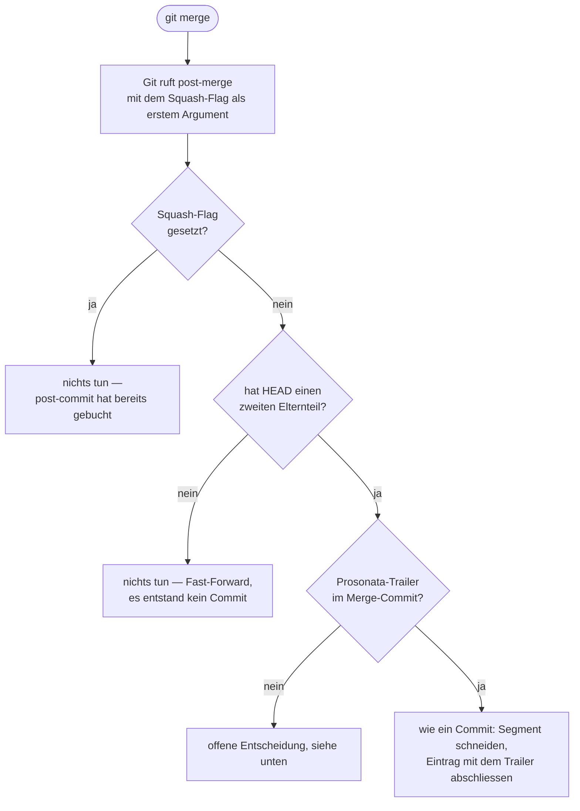

# Der `post-merge`-Hook

Warum ein Merge heute an der Zeiterfassung vorbeigeht und was ein zweiter Hook dagegen tun müsste.
Ergänzt [KONZEPT.md](../KONZEPT.md), ersetzt nichts darin. Stand: September 2026, **nichts davon
gebaut**.

## Die Lücke

Auf dem Hauptbranch schliesst jeder Commit seinen Zeiteintrag ab (KONZEPT §3). Ein Merge-Commit
**ist** ein Commit — nur ruft Git dafür einen anderen Hook, und das Werkzeug installiert bisher
nur `post-commit`.

Am eigenen Rechner in einem Wegwerf-Repository gemessen:

| Merge-Art | Welcher Hook feuert | Entsteht ein Commit? |
|---|---|---|
| `git merge --no-ff` | nur `post-merge` | ja, ein Merge-Commit |
| `git merge` (Fast-Forward) | nur `post-merge` | nein, der Zeiger rückt vor |
| `git merge --squash`, danach `git commit` | `post-commit` **und** `post-merge` | ja, ein gewöhnlicher |

Deshalb fällt die Lücke selten auf: Die Konventionen setzen Squash als Vorgabe, und dort committet
man selbst, also feuert `post-commit`. Nur `--no-ff`, die ausdrückliche Ausnahme, geht vorbei.

**Der Fall, an dem es sichtbar wurde.** In `lequipe-visuelle.ch` wurde `modulnamen-p5` mit
`--no-ff` nach `main` gebracht. Der Merge-Commit trug einen sauberen Trailer:

```
Prosonata: Website-Vorlagen vereinheitlicht: Benennung der Seitenbausteine,
Bildformate und Untermenü-Buttons
```

Angekommen ist er nie. Auf `main` blieb ein offener Eintrag mit 0:40 h ohne Text, und der Merge —
die Stelle, an der die Leistung fertig wird — blieb für die Zeiterfassung unsichtbar.

## Was der Hook nicht tun darf

Ein Hook, der einen Merge einfach wie einen Commit behandelt, wäre schlimmer als die Lücke. Drei
Fälle muss er auslassen.

**Fast-Forward.** Es entsteht kein neuer Commit. Es gibt nichts abzuschliessen, und der Text käme
von einem Commit, der längst zum Eintrag des Branches gehört.

**Squash.** `post-commit` hat schon gebucht. Ein zweiter Durchgang legte einen zweiten Eintrag an,
also genau den Fehler mit den doppelten Rechnungspositionen, gegen den es den Anspruch vor dem
Anlegen gibt (KONZEPT §7).

**Ein Merge ohne Trailer**, und das ist der wichtigste. Ohne Trailer gilt auf dem Hauptbranch die
Betreffzeile — bei Merges ist die aber maschinell erzeugt. In `lequipe-visuelle.ch` gezählt:

| Merge-Commits im Repository | mit `Prosonata:`-Trailer |
|---|---|
| 30 | 1 |

Die übrigen heissen «Merge pull request #183 from profitlich-ch/166-kundenliste-…» oder
«Merge commit 'dd5da4d…' as 'modules/themelab'». Ein Hook ohne diese Bedingung schriebe solche
Zeilen auf Kundenrechnungen. Dazu kommt, dass `pull.rebase` nicht gesetzt ist: `git pull` erzeugt
Merge-Commits, sobald eigene Commits vorliegen, und ist damit die häufigste Quelle genau dieser
Texte.

## Die Entscheidungskette

Unterscheiden lässt sich alles drei zuverlässig. Das Squash-Flag gibt Git dem Hook als erstes
Argument mit; ob ein Merge-Commit entstand, sagt `git rev-parse HEAD^2`, das nur bei zwei
Elternteilen gelingt; den Trailer liest das Werkzeug ohnehin schon.



## Wo die Logik hingehört

Die Hook-Zeile bleibt ein Einzeiler und ruft `prosonata post-merge "$1"`. Die drei Bedingungen
gehören nach TypeScript, nicht in die Shell — nur dort sind sie prüfbar, und dieser Hook ist
viermal still ausgefallen (KONZEPT §8). Trifft keine Ausnahme zu, geht es denselben Weg wie ein
Commit, also durch `Session.commit`.

Mitzuziehen wäre:

| Was | Warum |
|---|---|
| `prosonata init` installiert **beide** Hooks | sonst bleibt der neue in bestehenden Repos aus |
| `hookNeedsRepair` und `isInstalled` sehen beide an | heute prüfen sie nur `post-commit`, und ein fehlender zweiter fiele nie auf |
| `core.hooksPath` und die Regel für verfolgte Hooks gelten mit | in `KSA-wuslon-editor` liegt bereits ein fremder `post-merge` in `.githooks` — dort bricht die Installation ab und sagt es |

## Offen: der Merge ohne Trailer

Zwei Wege, und die Wahl gehört dem Benutzer.

| | Was geschieht | Preis |
|---|---|---|
| **Nur mit Trailer abschliessen** *(empfohlen)* | Ein Merge, der eine Rechnungszeile werden soll, sagt es. Alles andere bleibt unberührt. | Ein `--no-ff`-Merge ohne Trailer bleibt unsichtbar, die Zeit fliesst in den nächsten Eintrag. |
| **Ohne Trailer nur das Segment schneiden** | Die Zeit ist richtig zugeordnet, der Eintrag bleibt offen. | Dass ein Text fehlt, merkt niemand ausser der Zeile *Ohne Text* im Panel. |

Empfohlen ist der erste, aus dem Verhältnis eins zu dreissig: Merges sind in diesen Repositories
weit überwiegend mechanisch, und ein Werkzeug, das aus einem `git pull` eine Rechnungsposition
macht, wäre keins.

## Prüfung

Jeder Test mit Gegenprobe — die Bedingung zurücknehmen und sehen, ob er fällt.

- **Squash:** Hook mit gesetztem Flag ändert nichts, auch wenn ein Trailer vorliegt.
- **Fast-Forward:** Hook auf einem `HEAD` ohne zweiten Elternteil ändert nichts.
- **Merge-Commit mit Trailer:** schliesst den Eintrag mit dem Text des Trailers, wie ein Commit.
- **Merge-Commit ohne Trailer:** je nach Entscheidung oben, aber in keinem Fall mit der
  maschinellen Betreffzeile als Rechnungstext.
- **Installation:** `init` legt beide Hooks an; die Reparaturprüfung meldet einen fehlenden
  `post-merge`; ein verfolgter fremder `post-merge` führt zum Abbruch mit Meldung.
